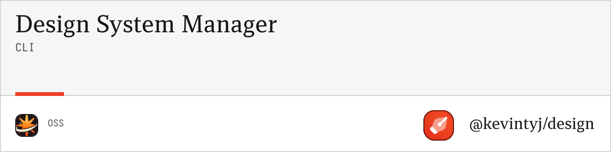

# @kevintyj/design/cli

Command-line interface for design system generation. Generate colors, spacing, and complete design systems from your `base.ts` configuration file.

## 🚀 Features

- **Color Generation** with Radix UI methodology (12-step progressions)
- **Spacing Generation** with 4px base multiplier system (26 spacing values)
- **System Generation** for complete design systems
- **Multiple Output Formats** (CSS, JSON, Figma)
- **Organized Folder Structure** (colors/, spacing/, combined/)
- **Validation** for color and spacing definitions
- **Interactive Commands** with progress indicators
- **TypeScript Support** with full type safety

## 📦 Installation

```bash
bun add @kevintyj/design/cli
```

## 🚀 Quick Start

```bash
# Help
bun @kevintyj/design/cli help

# Generate complete design system
bun @kevintyj/design/cli system quick

# Generate colors from base.ts
bun @kevintyj/design/cli colors quick

# Generate spacing from base.ts
bun @kevintyj/design/cli spacing quick

# Validate definitions
bun @kevintyj/design/cli system validate

# List available colors and spacing
bun @kevintyj/design/cli colors list
bun @kevintyj/design/cli spacing list
```

## 📖 Commands Overview

### Quick Commands

#### `system quick`
Generate complete design system with all features enabled.

```bash
bun @kevintyj/design/cli system quick [options]

Options:
  --input <file>     Input file path (default: "./base.ts")
  --output <dir>     Output directory (default: "./output")
  --verbose          Show detailed progress
```

#### `colors quick`
Quick color generation with all features enabled.

```bash
bun @kevintyj/design/cli colors quick [options]

Options:
  --input <file>     Input file path (default: "./base.ts")
  --output <dir>     Output directory (default: "./output")
  --verbose          Show detailed progress
```

#### `spacing quick`
Quick spacing generation with all features enabled.

```bash
bun @kevintyj/design/cli spacing quick [options]

Options:
  --input <file>     Input file path (default: "./base.ts")
  --output <dir>     Output directory (default: "./output")
  --verbose          Show detailed progress
```

### Validation Commands

#### `system validate`
Validates both color and spacing definitions in `base.ts`.

```bash
bun @kevintyj/design/cli system validate [options]

Options:
  --input <file>    Input file path (default: "./base.ts")
  --verbose         Show detailed validation info
```

#### `colors validate`
Validates color definitions in `base.ts`.

```bash
bun @kevintyj/design/cli colors validate [options]

Options:
  --input <file>    Input file path (default: "./base.ts")
  --verbose         Show detailed validation info
```

#### `spacing validate`
Validates spacing definitions in `base.ts`.

```bash
bun @kevintyj/design/cli spacing validate [options]

Options:
  --input <file>    Input file path (default: "./base.ts")
  --verbose         Show detailed validation info
```

### List Commands

#### `colors list`
Lists all available colors with visual preview.

```bash
bun @kevintyj/design/cli colors list [options]

Options:
  --input <file>    Input file path (default: "./base.ts")
  --format <type>   Output format (table|json) (default: "table")
```

#### `spacing list`
Lists all available spacing values with visual preview.

```bash
bun @kevintyj/design/cli spacing list [options]

Options:
  --input <file>    Input file path (default: "./base.ts")
  --format <type>   Output format (table|json) (default: "table")
```

### Generation Commands

#### `system generate`
Full control system generation.

```bash
bun @kevintyj/design/cli system generate [options]

Options:
  --input <file>         Input file path (default: "./base.ts")
  --output <dir>         Output directory (default: "./output")
  --formats <formats>    Output formats (css,json,figma,all) (default: "all")
  --verbose             Show detailed progress
```

#### `colors generate`
Full control color generation.

```bash
bun @kevintyj/design/cli colors generate [options]

Options:
  --input <file>         Input file path (default: "./base.ts")
  --output <dir>         Output directory (default: "./output")
  --formats <formats>    Output formats (css,json,figma,all) (default: "all")
  --no-alpha            Exclude alpha variants
  --no-gray-scale       Exclude gray scale variants
  --no-wide-gamut       Exclude P3 wide gamut colors
  --css-prefix <prefix>  CSS variable prefix (default: "--color")
  --json-format <type>   JSON format (flat|nested|tokens|tailwind|all) (default: "all")
  --json-pretty         Pretty print JSON output
  --verbose             Show detailed progress
```

#### `spacing generate`
Full control spacing generation.

```bash
bun @kevintyj/design/cli spacing generate [options]

Options:
  --input <file>         Input file path (default: "./base.ts")
  --output <dir>         Output directory (default: "./output")
  --formats <formats>    Output formats (css,json,figma,all) (default: "all")
  --css-prefix <prefix>  CSS variable prefix (default: "--spacing")
  --json-format <type>   JSON format (flat|nested|tokens|tailwind|all) (default: "all")
  --json-pretty         Pretty print JSON output
  --no-utilities        Skip utility class generation
  --verbose             Show detailed progress
```

### Figma Integration

#### `system figma`
Generate complete Figma-compatible JSON.

```bash
bun @kevintyj/design/cli system figma [options]

Options:
  --input <file>     Input file path (default: "./base.ts")
  --output <dir>     Output directory (default: "./output/figma")
  --format <type>    Figma format (collections|variables|all) (default: "collections")
  --verbose          Show detailed progress
```

#### `colors figma`
Generate Figma-compatible color JSON.

```bash
bun @kevintyj/design/cli colors figma [options]

Options:
  --input <file>     Input file path (default: "./base.ts")
  --output <file>    Output file path (default: "./output/figma/colors-figma.json")
  --format <type>    Figma format (collections|variables) (default: "collections")
  --verbose          Show detailed progress
```

#### `spacing figma`
Generate Figma-compatible spacing JSON.

```bash
bun @kevintyj/design/cli spacing figma [options]

Options:
  --input <file>     Input file path (default: "./base.ts")
  --output <file>    Output file path (default: "./output/figma/spacing-figma.json")
  --format <type>    Figma format (collections|variables) (default: "collections")
  --verbose          Show detailed progress
```

### Global Options

```bash
Options:
  -h, --help     Show help information
  -v, --version  Show version number
  --verbose      Enable verbose output
  --no-color     Disable colored output
```

## 🎯 Output Structure

Generated files are organized in a clear folder structure:

```
output/
├── css/
│   ├── colors/
│   │   ├── colors-light.css
│   │   ├── colors-dark.css
│   │   ├── colors-combined.css
│   │   └── colors-full-*.css
│   ├── spacing/
│   │   ├── spacing.css
│   │   ├── spacing-px.css
│   │   ├── spacing-rem.css
│   │   ├── spacing-combined.css
│   │   └── spacing-utilities.css
│   └── combined/
│       └── design-system.css
├── json/
│   ├── colors/
│   │   ├── colors-flat.json
│   │   ├── colors-nested.json
│   │   ├── colors-tokens.json
│   │   └── colors-tailwind.json
│   ├── spacing/
│   │   ├── spacing-flat.json
│   │   ├── spacing-nested.json
│   │   ├── spacing-tokens.json
│   │   ├── spacing-tailwind.json
│   │   └── spacing-collections.json
│   └── combined/
│       └── design-system.json
└── figma/
    ├── colors-figma.json
    ├── spacing-figma.json
    └── system-figma.json
```

## 💡 Usage Examples

### System Generation

```bash
# Quick generation of complete design system
bun @kevintyj/design/cli system quick

# Generate to specific directory
bun @kevintyj/design/cli system quick --output ./dist/design-system

# Generate with verbose output
bun @kevintyj/design/cli system generate --verbose

# Generate only CSS files for the entire system
bun @kevintyj/design/cli system generate --formats css --output ./styles
```

### Color Generation

```bash
# Quick color generation with default settings
bun @kevintyj/design/cli colors quick

# Generate only CSS files
bun @kevintyj/design/cli colors generate --formats css --output ./styles

# Generate minimal colors (no alpha, no P3)
bun @kevintyj/design/cli colors generate --no-alpha --no-wide-gamut --output ./minimal

# Generate with custom CSS prefix
bun @kevintyj/design/cli colors generate --css-prefix "--theme" --formats css

# Generate pretty JSON tokens
bun @kevintyj/design/cli colors generate --formats json --json-format tokens --json-pretty
```

### Spacing Generation

```bash
# Quick spacing generation
bun @kevintyj/design/cli spacing quick

# Generate only CSS files
bun @kevintyj/design/cli spacing generate --formats css --output ./styles

# Generate without utility classes
bun @kevintyj/design/cli spacing generate --no-utilities --formats css

# Generate Tailwind-compatible JSON
bun @kevintyj/design/cli spacing generate --formats json --json-format tailwind

# Generate with custom CSS prefix
bun @kevintyj/design/cli spacing generate --css-prefix "--space" --formats css
```

### Validation and Inspection

```bash
# Validate complete system
bun @kevintyj/design/cli system validate --verbose

# Validate colors only
bun @kevintyj/design/cli colors validate --verbose

# Validate spacing only
bun @kevintyj/design/cli spacing validate --verbose

# List colors with details
bun @kevintyj/design/cli colors list

# List spacing values
bun @kevintyj/design/cli spacing list

# Check definitions from different file
bun @kevintyj/design/cli system validate --input ./design-tokens.ts
```

### Figma Integration

```bash
# Generate complete Figma export
bun @kevintyj/design/cli system figma --output ./figma-export

# Generate color collections for Figma
bun @kevintyj/design/cli colors figma --format collections --verbose

# Generate spacing variables for Figma
bun @kevintyj/design/cli spacing figma --format variables
```

## 🎨 Expected Input Format

The CLI expects a `base.ts` file with this structure:

### Color Definitions

```typescript
// base.ts
export const light = {
  primary: '#0066CC',
  secondary: '#6366F1',
  success: '#059669',
  warning: '#D97706',
  danger: '#DC2626',
  // ... more colors
};

export const dark = {
  primary: '#3B82F6',
  secondary: '#8B5CF6',
  success: '#10B981',
  warning: '#F59E0B',
  danger: '#EF4444',
  // ... more colors
};

export const constantsLight = {
  gray: '#6B7280',
  background: '#FFFFFF',
  foreground: '#111827'
};

export const constantsDark = {
  gray: '#9CA3AF',
  background: '#111827',
  foreground: '#F9FAFB'
};
```

### Spacing Definitions

```typescript
// base.ts (continued)
export const spacing = {
  "0": 0,
  "px": 1,
  "2px": 2,
  "3px": 3,
  "1": 4,
  "5px": 5,
  "6px": 6,
  "2": 8,
  "10px": 10,
  "3": 12,
  "14px": 14,
  "4": 16,
  "5": 20,
  "6": 24,
  "7": 28,
  "8": 32,
  "9": 36,
  "10": 40,
  "11": 44,
  "12": 48,
  "13": 52,
  "14": 56,
  "15": 60,
  "16": 64,
  "18": 72,
  "20": 80
};

export const spacingMultiplier = 4;
```

## 🎯 Generated Output Examples

### CSS Custom Properties

**Colors:**
```css
:root {
  /* Color scale */
  --color-primary-1: #fcfdff;
  --color-primary-9: #0066cc;
  --color-primary-12: #003d7a;
  
  /* Alpha variants */
  --color-primary-a1: rgba(0, 102, 204, 0.05);
  --color-primary-a9: rgba(0, 102, 204, 0.9);
  
  /* Wide gamut P3 */
  --color-primary-p3-1: oklch(99.4% 0.0025 259.5);
}
```

**Spacing:**
```css
:root {
  /* Spacing values */
  --spacing-0: 0px;
  --spacing-1: 4px;
  --spacing-2: 8px;
  --spacing-4: 16px;
  
  /* REM equivalents */
  --spacing-1-rem: 0.25rem;
  --spacing-2-rem: 0.5rem;
}

/* Utility classes */
.m-1 { margin: 4px; }
.p-2 { padding: 8px; }
.gap-4 { gap: 16px; }
```

### JSON Formats

**Tailwind Config:**
```json
{
  "theme": {
    "colors": {
      "primary": {
        "50": "#fcfdff",
        "500": "#0066cc",
        "950": "#003d7a"
      }
    },
    "spacing": {
      "0": "0px",
      "1": "4px",
      "2": "8px",
      "4": "16px"
    }
  }
}
```

**Design Tokens:**
```json
{
  "color": {
    "primary": {
      "value": "#0066cc",
      "type": "color"
    }
  },
  "spacing": {
    "small": {
      "value": "4px",
      "type": "dimension"
    }
  }
}
```

## 🛠 Development

### From Root Package

When using from the monorepo root:

```bash
# Quick commands
bun run system:quick
bun run colors:quick
bun run spacing:quick

# Validation
bun run system:validate
bun run colors:validate
bun run spacing:validate

# List values
bun run colors:list
bun run spacing:list

# Generation with options
bun run system:generate --verbose --output ./dist
bun run colors:generate --formats css --no-alpha
bun run spacing:generate --formats json --json-pretty
```

### Building the CLI

```bash
# Build CLI package
bun run build

# Build specific CLI package
bun run build:package cli

# Clean and rebuild
bun run build:clean && bun run build
```

## 🎯 Performance Tips

### Fast Development

- Use `quick` commands for rapid iteration
- Use `--no-alpha --no-gray-scale` for minimal color output during testing
- Generate only needed formats: `--formats css` or `--formats json`
- Use `--verbose` to debug generation issues

### Output Optimization

- Use organized folder structure for better file management
- Generate only needed formats for production builds
- Use `--json-pretty` only for development, minified for production
- Leverage the combined output for single-file imports

## 🔗 Integration

### With Build Tools

```bash
# Add to package.json scripts
{
  "scripts": {
    "design:build": "bun @kevintyj/design/cli system quick --output ./src/styles",
    "design:colors": "bun @kevintyj/design/cli colors generate --formats css --output ./src/styles/colors",
    "design:spacing": "bun @kevintyj/design/cli spacing generate --formats css --output ./src/styles/spacing"
  }
}
```

### With CI/CD

```yaml
# GitHub Actions example
- name: Generate Design System
  run: |
    bun install
    bun @kevintyj/design/cli system generate --output ./dist/design-system
    bun @kevintyj/design/cli system validate
```

### With CSS Frameworks

```bash
# Generate Tailwind-compatible config
bun @kevintyj/design/cli system generate --formats json --json-format tailwind --output ./tailwind

# Generate CSS custom properties for any framework
bun @kevintyj/design/cli system generate --formats css --output ./src/styles
```

## 📄 License

MIT License - see the [LICENSE](../../LICENSE) file for details. 