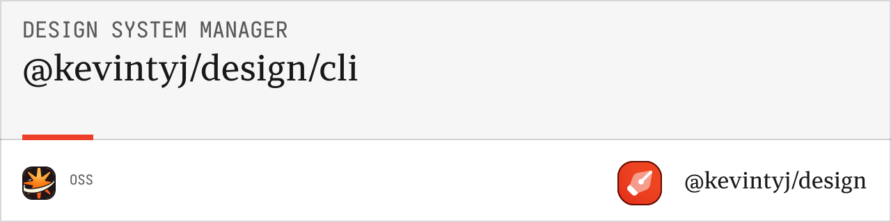

# @design/cli

Command-line interface for design system generation. Generate colors, spacing, and complete design systems from your `base.ts` configuration file.

## 🚀 Features

- **Color Generation** with Radix UI methodology
- **Spacing Generation** with 4px base multiplier system  
- **Multiple Output Formats** (CSS, JSON, Figma)
- **Organized Folder Structure** (colors/, spacing/, combined/)
- **Validation** for color and spacing definitions
- **Interactive Commands** with progress indicators
- **TypeScript Support** with full type safety

## 📦 Installation

```bash
bun add @design/cli
```

## 🚀 Quick Start

```bash
# Help
bun run help # from root

# Generate colors from base.ts
bun @design/cli quick

# Validate definitions
bun @design/cli validate

# List available colors
bun @design/cli list

# Generate with custom options
bun @design/cli generate --output ./dist --formats css,json --verbose
```

## 📖 Commands

### Color Commands

#### `validate`
Validates color definitions in `base.ts`.

```bash
bun @design/cli validate [options]

Options:
  --input <file>    Input file path (default: "./base.ts")
  --verbose         Show detailed validation info
```

#### `list`
Lists all available colors with visual preview.

```bash
bun @design/cli list [options]

Options:
  --input <file>    Input file path (default: "./base.ts")
  --format <type>   Output format (table|json) (default: "table")
```

#### `quick`
Quick generation with all features enabled.

```bash
bun @design/cli quick [options]

Options:
  --input <file>     Input file path (default: "./base.ts")
  --output <dir>     Output directory (default: "./output")
  --verbose          Show detailed progress
```

#### `generate`
Full control color generation.

```bash
bun @design/cli generate [options]

Options:
  --input <file>         Input file path (default: "./base.ts")
  --output <dir>         Output directory (default: "./output")
  --formats <formats>    Output formats (css,json,all) (default: "all")
  --no-alpha            Exclude alpha variants
  --no-gray-scale       Exclude gray scale variants
  --no-wide-gamut       Exclude P3 wide gamut colors
  --css-prefix <prefix>  CSS variable prefix (default: "--color")
  --json-format <type>   JSON format (flat|nested|tokens|tailwind) (default: "all")
  --json-pretty         Pretty print JSON output
  --verbose             Show detailed progress
```

#### `figma`
Generate Figma-compatible JSON.

```bash
bun @design/cli figma [options]

Options:
  --input <file>     Input file path (default: "./base.ts")
  --output <file>    Output file path (default: "./output/figma/figma-colors.json")
  --format <type>    Figma format (collections|variables) (default: "collections")
  --verbose          Show detailed progress
```

### Global Options

```bash
Options:
  -h, --help     Show help information
  -v, --version  Show version number
  --verbose      Enable verbose output
  --no-color     Disable colored output
```

## 🎯 Output Structure

Generated files are organized in a clear folder structure:

```
output/
├── css/
│   ├── colors/
│   │   ├── colors-light.css
│   │   ├── colors-dark.css
│   │   ├── colors-combined.css
│   │   └── colors-full-*.css
│   ├── spacing/              # 🚧 Coming soon
│   └── combined/             # 🚧 Coming soon
├── json/
│   ├── colors/
│   │   ├── colors-flat.json
│   │   ├── colors-nested.json
│   │   ├── colors-tokens.json
│   │   └── colors-tailwind.json
│   ├── spacing/              # 🚧 Coming soon
│   └── combined/             # 🚧 Coming soon
└── figma/
    ├── figma-colors.json
    ├── figma-spacing.json    # 🚧 Coming soon
    └── figma-combined.json   # 🚧 Coming soon
```

## 💡 Usage Examples

### Basic Generation

```bash
# Quick generation with default settings
bun @design/cli quick

# Generate to specific directory
bun @design/cli quick --output ./dist/design-system
```

### Custom Configuration

```bash
# Generate only CSS files
bun @design/cli generate --formats css --output ./styles

# Generate minimal colors (no alpha, no P3)
bun @design/cli generate --no-alpha --no-wide-gamut --output ./minimal

# Generate with custom CSS prefix
bun @design/cli generate --css-prefix "--theme" --formats css

# Generate pretty JSON tokens
bun @design/cli generate --formats json --json-format tokens --json-pretty
```

### Validation and Inspection

```bash
# Validate color definitions
bun @design/cli validate --verbose

# List colors with details
bun @design/cli list

# Check colors from different file
bun @design/cli validate --input ./colors.ts
```

### Figma Integration

```bash
# Generate Figma collections
bun @design/cli figma --output ./figma-colors.json

# Generate for Figma plugin
bun @design/cli figma --format collections --verbose
```

### Verbose Output

```bash
# See detailed generation process
bun @design/cli generate --verbose

# Debug validation issues
bun @design/cli validate --verbose
```

## 🎨 Color Input Format

The CLI expects a `base.ts` file with this structure:

```typescript
// base.ts
export const light = {
  primary: '#0066CC',
  secondary: '#6366F1',
  success: '#059669',
  warning: '#D97706',
  danger: '#DC2626'
};

export const dark = {
  primary: '#3B82F6',
  secondary: '#8B5CF6', 
  success: '#10B981',
  warning: '#F59E0B',
  danger: '#EF4444'
};

export const constantsLight = {
  gray: '#6B7280',
  background: '#FFFFFF'
};

export const constantsDark = {
  gray: '#9CA3AF',
  background: '#111827'
};

// Optional: Spacing configuration (coming soon)
export const spacing = {
  "0": 0,
  "px": 1,
  "1": 4,
  "2": 8,
  "4": 16,
  "8": 32,
  "16": 64
};

export const multiplier = 4;
```

## 🛠 Integration Examples

### With npm Scripts

```json
{
  "scripts": {
    "design:validate": "@design/cli validate",
    "design:build": "@design/cli generate --output ./dist/design-system",
    "design:quick": "@design/cli quick --output ./public/css",
    "design:figma": "@design/cli figma --output ./figma-export.json"
  }
}
```

### With Build Tools

```bash
# Webpack/Vite integration
bun @design/cli generate --output ./src/styles --formats css

# Generate before build
bun @design/cli quick && bun run build
```

### CI/CD Integration

```yaml
# GitHub Actions example
- name: Generate Design System
  run: |
    bun @design/cli validate
    bun @design/cli generate --output ./dist/design-system
    
- name: Upload Artifacts
  uses: actions/upload-artifact@v3
  with:
    name: design-system
    path: ./dist/design-system
```

## 🎯 Command Output Examples

### Validation Output

```bash
$ bun @design/cli validate --verbose

✓ Validating color definitions...
✓ Found 9 colors in light mode
✓ Found 9 colors in dark mode  
✓ Found 2 constants in light mode
✓ Found 2 constants in dark mode
✓ All color values are valid hex colors
✓ Color definitions are valid

Colors found:
  🔥 blaze   #FC4B32 → #FD563D
  🍂 autumn  #311318 → #30181B
  🌸 pink    #F9486F → #F55776
  ...
```

### Generation Output

```bash
$ bun @design/cli generate --verbose

🎨 Generating design system...
📁 Output directory: ./output
📝 Input file: ./base.ts

✓ Loading color definitions...
✓ Validating colors...
✓ Generating color system...
✓ Creating output directories...

📄 Generating CSS files...
  ✓ colors-light.css (2.3 KB)
  ✓ colors-dark.css (2.3 KB)
  ✓ colors-combined.css (4.1 KB)

📄 Generating JSON files...
  ✓ colors-flat.json (1.8 KB)
  ✓ colors-nested.json (2.1 KB)
  ✓ colors-tokens.json (3.2 KB)
  ✓ colors-tailwind.json (1.5 KB)

📄 Generating Figma files...
  ✓ figma-colors.json (2.8 KB)

✨ Generated 21 files in 247ms
```

## 🚧 Upcoming Features

### Spacing Commands (In Development)
- `spacing:validate` - Validate spacing definitions
- `spacing:quick` - Quick spacing generation
- `spacing:generate` - Full spacing generation with utilities

### System Commands (Planned)
- `system:validate` - Validate complete design system
- `system:quick` - Generate colors and spacing together
- `system:generate` - Full design system generation

## 🧪 Testing

```bash
# Run CLI tests
bun test

# Test specific commands
bun test --grep "validate command"

# Integration tests
bun test:integration
```

## 🛠 Development

```bash
# Install dependencies
bun install

# Build the CLI
bun run build

# Link for local development
bun link

# Test locally
bun @design/cli --help
```

## 🤝 Related Packages

- **[@design/color-generation-core](../color-generation-core)** - Core color generation
- **[@design/color-generation-css](../color-generation-css)** - CSS output generation
- **[@design/color-generation-json](../color-generation-json)** - JSON output generation
- **[@design/spacing-generation-core](../spacing-generation-core)** - Core spacing generation

## 📄 License

MIT License - see the [LICENSE](../../LICENSE) file for details. 