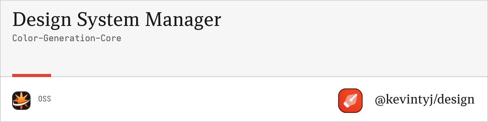

# @design/color-generation-core

Core color generation logic using Radix UI color methodology for generating comprehensive color scales.

## 🎨 Features

- **12-step color progressions** using Radix UI methodology
- **Alpha channel variants** for transparency effects
- **Wide gamut P3 support** for modern displays
- **Contextual gray scales** for each color
- **Special colors** (contrast, surface, indicator)
- **TypeScript support** with full type safety
- **Validation utilities** for color definitions
- **Flexible input formats** (TypeScript, JavaScript, JSON)

## 📦 Installation

```bash
bun add @design/color-generation-core
```

## 🚀 Quick Start

```typescript
import { 
  loadColorDefinitions,
  generateColorSystem,
  validateColorInput 
} from '@design/color-generation-core';

// Load colors from file
const colorInput = await loadColorDefinitions('./base.ts');

// Validate color definitions
validateColorInput(colorInput);

// Generate complete color system
const colorSystem = generateColorSystem(colorInput, {
  includeAlpha: true,
  includeWideGamut: true,
  includeGrayScale: true,
  includeOverlays: true
});

console.log(`Generated ${colorSystem.metadata.totalScales} color scales`);
```

## 📖 API Reference

### Types

#### `ColorInput`
Core interface for color definitions with light/dark mode support.

```typescript
interface ColorInput {
  light: ColorDefinition;
  dark: ColorDefinition;
  constants: {
    light: ColorConstants;
    dark: ColorConstants;
  };
}

interface ColorDefinition {
  [colorName: string]: string; // hex color values
}

interface ColorConstants {
  gray?: string;
  background?: string;
  foreground?: string;
  [key: string]: string | undefined;
}
```

#### `ColorSystem`
Complete generated color system with all scales and metadata.

```typescript
interface ColorSystem {
  light: Record<string, ColorScale>;
  dark: Record<string, ColorScale>;
  colorNames: string[];
  sourceColors: ColorInput;
  metadata: {
    generatedAt: string;
    totalColors: number;
    totalScales: number;
    config: Required<GenerationConfig>;
  };
}

interface ColorScale {
  // Main scale (1-12)
  1: string;
  2: string;
  // ... through 12
  
  // Alpha variants (a1-a12)
  a1: string;
  a2: string;
  // ... through a12
  
  // Wide gamut P3 (p3-1 to p3-12)
  'p3-1': string;
  'p3-2': string;
  // ... through p3-12
  
  // Special colors
  contrast: string;
  surface: string;
  indicator: string;
}
```

#### `GenerationConfig`
Configuration options for color system generation.

```typescript
interface GenerationConfig {
  includeAlpha?: boolean;        // Default: true
  includeWideGamut?: boolean;   // Default: true
  includeGrayScale?: boolean;   // Default: true
  includeOverlays?: boolean;    // Default: true
}
```

### Core Functions

#### `generateColorSystem(colorInput, config?)`

Generates a complete color system with all scales and variants.

**Parameters:**
- `colorInput: ColorInput` - Color definitions for light and dark modes
- `config?: GenerationConfig` - Optional configuration

**Returns:** `ColorSystem`

**Example:**
```typescript
const colorSystem = generateColorSystem(colorInput, {
  includeAlpha: true,
  includeWideGamut: false, // Skip P3 for smaller output
  includeGrayScale: true,
  includeOverlays: true
});
```

#### `loadColorDefinitions(filePath)`

Loads color definitions from a TypeScript/JavaScript file.

**Parameters:**
- `filePath: string` - Path to the color definition file

**Returns:** `Promise<ColorInput>`

**Example:**
```typescript
// Load from base.ts
const colorInput = await loadColorDefinitions('./base.ts');

// Load from custom file
const colorInput = await loadColorDefinitions('./colors/theme.js');
```

#### `validateColorInput(colorInput)`

Validates color input structure and throws descriptive errors.

**Parameters:**
- `colorInput: ColorInput` - Color definitions to validate

**Throws:** Error with validation details

**Example:**
```typescript
try {
  validateColorInput(colorInput);
  console.log('✓ Color definitions are valid');
} catch (error) {
  console.error('✗ Validation failed:', error.message);
}
```

#### `createColorInput(light, dark, lightConstants, darkConstants)`

Creates a color input object from separate definitions.

**Parameters:**
- `light: ColorDefinition` - Light mode colors
- `dark: ColorDefinition` - Dark mode colors  
- `lightConstants: ColorConstants` - Light mode constants
- `darkConstants: ColorConstants` - Dark mode constants

**Returns:** `ColorInput`

**Example:**
```typescript
const colorInput = createColorInput(
  { primary: '#0066CC', secondary: '#6366F1' },
  { primary: '#3B82F6', secondary: '#8B5CF6' },
  { gray: '#6B7280', background: '#FFFFFF' },
  { gray: '#9CA3AF', background: '#111827' }
);
```

### Utility Functions

#### `getColorScale(colorSystem, colorName, appearance)`

Retrieves a specific color scale from the system.

**Parameters:**
- `colorSystem: ColorSystem` - Generated color system
- `colorName: string` - Name of the color
- `appearance: "light" | "dark"` - Color mode

**Returns:** `ColorScale`

**Example:**
```typescript
const primaryScale = getColorScale(colorSystem, 'primary', 'light');
console.log(primaryScale[9]); // Primary color step 9
```

#### `getColorMetadata(colorSystem)`

Extracts metadata information from a color system.

**Parameters:**
- `colorSystem: ColorSystem` - Generated color system

**Returns:** `ColorSystemMetadata`

**Example:**
```typescript
const metadata = getColorMetadata(colorSystem);
console.log(`Generated ${metadata.totalColors} colors in ${metadata.totalScales} scales`);
```

#### `mergeColorSystems(systems)`

Merges multiple color systems into one.

**Parameters:**
- `systems: ColorSystem[]` - Array of color systems to merge

**Returns:** `ColorSystem`

**Example:**
```typescript
const brandColors = generateColorSystem(brandInput);
const semanticColors = generateColorSystem(semanticInput);
const merged = mergeColorSystems([brandColors, semanticColors]);
```

## 🎯 Color Scale Structure

Each generated color scale follows the Radix UI methodology:

### Main Scale (1-12)
- **Steps 1-2**: Backgrounds, subtle borders
- **Steps 3-5**: UI component backgrounds
- **Steps 6-8**: Borders, separators  
- **Steps 9-10**: Solid backgrounds, primary actions
- **Steps 11-12**: High contrast text, active states

### Alpha Variants (a1-a12)
- Semi-transparent versions of each step
- Perfect for overlays and subtle backgrounds
- Maintains visual consistency across backgrounds

### Wide Gamut P3 (p3-1 to p3-12)
- Enhanced color range for modern displays
- Uses oklch() color space for better color handling
- Automatic fallback to sRGB for compatibility

### Special Colors
- **contrast**: High contrast text color for accessibility
- **surface**: Subtle background overlay for layered UI
- **indicator**: Status/accent color for notifications

## 💡 Usage Examples

### Basic Generation

```typescript
import { createColorInput, generateColorSystem } from '@design/color-generation-core';

const colorInput = createColorInput(
  { primary: '#0066CC', secondary: '#6366F1' },
  { primary: '#3B82F6', secondary: '#8B5CF6' },
  { gray: '#6B7280', background: '#FFFFFF' },
  { gray: '#9CA3AF', background: '#111827' }
);

const colorSystem = generateColorSystem(colorInput);
```

### Custom Configuration

```typescript
const colorSystem = generateColorSystem(colorInput, {
  includeAlpha: false,      // Skip alpha variants
  includeWideGamut: false,  // Skip P3 colors
  includeGrayScale: true,   // Include gray scales
  includeOverlays: false    // Skip overlay colors
});
```

### Loading from File

```typescript
// base.ts structure
export const light = {
  primary: '#0066CC',
  success: '#059669',
  warning: '#D97706'
};

export const dark = {
  primary: '#3B82F6',
  success: '#10B981',
  warning: '#F59E0B'
};

export const constantsLight = {
  gray: '#6B7280',
  background: '#FFFFFF'
};

export const constantsDark = {
  gray: '#9CA3AF',
  background: '#111827'
};

// Load and generate
const colorInput = await loadColorDefinitions('./base.ts');
const colorSystem = generateColorSystem(colorInput);
```

### Accessing Generated Colors

```typescript
// Get a specific color scale
const primaryScale = getColorScale(colorSystem, 'primary', 'light');

// Access specific steps
const primaryButton = primaryScale[9];      // Primary action color
const primaryText = primaryScale[12];       // High contrast text
const primarySurface = primaryScale.surface; // Subtle background

// Alpha variants for overlays
const primaryOverlay = primaryScale.a6;     // Semi-transparent overlay

// Wide gamut for modern displays
const primaryP3 = primaryScale['p3-9'];     // P3 primary action color
```

### Validation and Error Handling

```typescript
import { validateColorInput, loadColorDefinitions } from '@design/color-generation-core';

try {
  const colorInput = await loadColorDefinitions('./colors.ts');
  validateColorInput(colorInput);
  
  const colorSystem = generateColorSystem(colorInput);
  console.log('✓ Color system generated successfully');
} catch (error) {
  if (error.message.includes('Invalid hex color')) {
    console.error('✗ Color validation failed:', error.message);
  } else if (error.message.includes('Missing required')) {
    console.error('✗ Missing required color definitions:', error.message);
  } else {
    console.error('✗ Generation failed:', error.message);
  }
}
```

### Advanced Color Manipulation

```typescript
import { generateColorSystem, getColorScale, mergeColorSystems } from '@design/color-generation-core';

// Generate brand colors
const brandInput = createColorInput(
  { brand: '#FF6B35', accent: '#4ECDC4' },
  { brand: '#FF7F59', accent: '#45B7B8' },
  // ... constants
);

// Generate semantic colors
const semanticInput = createColorInput(
  { success: '#28B450', error: '#DA3132' },
  { success: '#51B251', error: '#DE393A' },
  // ... constants
);

const brandColors = generateColorSystem(brandInput);
const semanticColors = generateColorSystem(semanticInput);

// Merge systems
const completeSystem = mergeColorSystems([brandColors, semanticColors]);

// Extract specific scales for different use cases
const brandScale = getColorScale(completeSystem, 'brand', 'light');
const errorScale = getColorScale(completeSystem, 'error', 'dark');
```

## 🎨 Color Input Formats

### TypeScript/JavaScript Files

```typescript
// base.ts or colors.js
export const light = {
  primary: '#0066CC',
  secondary: '#6366F1'
};

export const dark = {
  primary: '#3B82F6',
  secondary: '#8B5CF6'
};

export const constantsLight = {
  gray: '#6B7280'
};

export const constantsDark = {
  gray: '#9CA3AF'
};
```

### JSON Files

```json
{
  "light": {
    "primary": "#0066CC",
    "secondary": "#6366F1"
  },
  "dark": {
    "primary": "#3B82F6",
    "secondary": "#8B5CF6"
  },
  "constants": {
    "light": { "gray": "#6B7280" },
    "dark": { "gray": "#9CA3AF" }
  }
}
```

## 🔧 Configuration Options

### Generation Configuration

```typescript
interface GenerationConfig {
  includeAlpha?: boolean;        // Include alpha variants (default: true)
  includeWideGamut?: boolean;   // Include P3 wide gamut (default: true)
  includeGrayScale?: boolean;   // Include gray scales (default: true)
  includeOverlays?: boolean;    // Include overlay colors (default: true)
}
```

### Performance Optimization

```typescript
// Minimal generation for development
const minimalConfig = {
  includeAlpha: false,
  includeWideGamut: false,
  includeGrayScale: false,
  includeOverlays: false
};

// Full generation for production
const fullConfig = {
  includeAlpha: true,
  includeWideGamut: true,
  includeGrayScale: true,
  includeOverlays: true
};
```

## 🧪 Testing

```typescript
import { generateColorSystem, validateColorInput } from '@design/color-generation-core';

// Test color generation
const testInput = createColorInput(
  { test: '#FF0000' },
  { test: '#FF6666' },
  { gray: '#888888' },
  { gray: '#AAAAAA' }
);

const system = generateColorSystem(testInput);
console.assert(system.colorNames.includes('test'));
console.assert(system.light.test[9] === '#FF0000');
```

## 🤝 Related Packages

- **[@design/color-generation-css](../color-generation-css)** - CSS output generation
- **[@design/color-generation-json](../color-generation-json)** - JSON output generation
- **[@design/cli](../cli)** - Command-line interface

## 📄 License

MIT License - see the [LICENSE](../../LICENSE) file for details. 