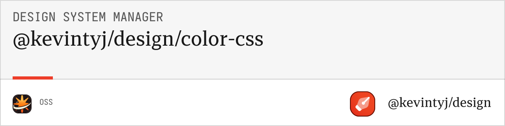

# @kevintyj/design/color-generation-css

CSS generation utilities for design system colors. Converts color systems into CSS custom properties, utility classes, and theme files.

## 🎨 Features

- **CSS Custom Properties** with semantic naming
- **Light/Dark Mode Support** with automatic media queries
- **Multiple Output Formats** (separate, combined, full)
- **Utility Classes** for quick prototyping
- **Wide Gamut P3** color support
- **Alpha Variants** for transparency effects
- **Configurable Prefixes** and naming conventions
- **TypeScript Support** with full type definitions

## 📦 Installation

```bash
bun add @kevintyj/design/color-generation-css
```

## 🚀 Quick Start

```typescript
import { generateCSSFiles } from '@kevintyj/design/color-generation-css';
import { generateColorSystem } from '@kevintyj/design/color-generation-core';

// Generate color system
const colorSystem = generateColorSystem(colorInput);

// Generate CSS files
const cssFiles = generateCSSFiles(colorSystem, {
  includeAlpha: true,
  includeWideGamut: true,
  generateUtilityClasses: true
});

// Write files to disk
cssFiles.forEach(file => {
  console.log(`Generated: ${file.filename}`);
  console.log(`Type: ${file.type}`);
  console.log(`Size: ${file.content.length} bytes`);
});
```

## 📖 API Reference

### Types

#### `CSSGenerationConfig`
Configuration options for CSS generation.

```typescript
interface CSSGenerationConfig {
  includeAlpha?: boolean;          // Include alpha variants (default: true)
  includeWideGamut?: boolean;      // Include P3 colors (default: true)
  generateUtilityClasses?: boolean; // Generate utility classes (default: false)
  cssPrefix?: string;              // Custom property prefix (default: "--color")
  outputVariant?: OutputVariant;   // Output format (default: "combined")
  includeGrayScale?: boolean;      // Include gray scale variants (default: true)
  includeSpecialColors?: boolean;  // Include contrast/surface/indicator (default: true)
}
```

#### `OutputVariant`
Different CSS output formats.

```typescript
type OutputVariant = 
  | "separate"    // Light and dark in separate files
  | "combined"    // Light and dark with media queries
  | "full";       // All variants in single file
```

#### `CSSFile`
Generated CSS file structure.

```typescript
interface CSSFile {
  filename: string;
  content: string;
  type: "light" | "dark" | "combined" | "utilities" | "full";
  size: number;
  metadata: {
    colorCount: number;
    propertyCount: number;
    hasAlpha: boolean;
    hasP3: boolean;
    hasUtilities: boolean;
  };
}
```

### Core Functions

#### `generateCSSFiles(colorSystem, config?)`

Generates CSS files from a color system with specified configuration.

**Parameters:**
- `colorSystem: ColorSystem` - Generated color system from core package
- `config?: CSSGenerationConfig` - Configuration options

**Returns:** `CSSFile[]`

**Example:**
```typescript
const cssFiles = generateCSSFiles(colorSystem, {
  includeAlpha: true,
  includeWideGamut: true,
  generateUtilityClasses: true,
  cssPrefix: '--color',
  outputVariant: 'combined'
});

// Results in files like:
// - colors-light.css
// - colors-dark.css
// - colors-combined.css
// - colors-utilities.css (if utilities enabled)
```

#### `generateCSSForColorSystem(colorSystem, config?)`

Generates CSS content as strings without file structure for programmatic use.

**Parameters:**
- `colorSystem: ColorSystem` - Generated color system
- `config?: CSSGenerationConfig` - Configuration options

**Returns:** `{ light: string; dark: string; combined: string; utilities?: string }`

**Example:**
```typescript
const cssContent = generateCSSForColorSystem(colorSystem, {
  includeAlpha: false,
  generateUtilityClasses: true
});

console.log('Light CSS:', cssContent.light);
console.log('Dark CSS:', cssContent.dark);
console.log('Utilities:', cssContent.utilities);
```

#### `generateUtilityClasses(colorSystem, config?)`

Generates utility classes for colors with Tailwind-compatible naming.

**Parameters:**
- `colorSystem: ColorSystem` - Generated color system
- `config?: Pick<CSSGenerationConfig, 'includeAlpha' | 'includeSpecialColors'>` - Configuration subset

**Returns:** `string`

**Example:**
```typescript
const utilities = generateUtilityClasses(colorSystem, {
  includeAlpha: true,
  includeSpecialColors: true
});
```

### Utility Functions

#### `generateLightModeCSS(colorSystem, config?)`

Generates CSS for light mode only.

**Parameters:**
- `colorSystem: ColorSystem` - Generated color system
- `config?: CSSGenerationConfig` - Configuration options

**Returns:** `string`

#### `generateDarkModeCSS(colorSystem, config?)`

Generates CSS for dark mode only.

**Parameters:**
- `colorSystem: ColorSystem` - Generated color system
- `config?: CSSGenerationConfig` - Configuration options

**Returns:** `string`

#### `generateCombinedCSS(colorSystem, config?)`

Generates CSS with light/dark modes using media queries.

**Parameters:**
- `colorSystem: ColorSystem` - Generated color system
- `config?: CSSGenerationConfig` - Configuration options

**Returns:** `string`

## 🎯 Generated CSS Structure

### Custom Properties

```css
:root {
  /* Main color scales (1-12) */
  --color-blue-1: #fcfdff;
  --color-blue-2: #f6f9ff;
  --color-blue-3: #eef4ff;
  --color-blue-4: #e1ecff;
  --color-blue-5: #cee0ff;
  --color-blue-6: #b7d0ff;
  --color-blue-7: #96bbff;
  --color-blue-8: #5e9eff;
  --color-blue-9: #0066cc;
  --color-blue-10: #0058b3;
  --color-blue-11: #004799;
  --color-blue-12: #113161;
  
  /* Alpha variants (a1-a12) */
  --color-blue-a1: rgba(0, 102, 204, 0.02);
  --color-blue-a2: rgba(0, 102, 204, 0.04);
  --color-blue-a3: rgba(0, 102, 204, 0.08);
  --color-blue-a9: rgba(0, 102, 204, 0.9);
  --color-blue-a12: rgba(0, 102, 204, 0.95);
  
  /* Wide gamut P3 (p3-1 to p3-12) */
  --color-blue-p3-1: oklch(99.4% 0.0025 259.5);
  --color-blue-p3-9: oklch(65.8% 0.142 259.5);
  --color-blue-p3-12: oklch(45.2% 0.142 259.5);
  
  /* Special colors */
  --color-blue-contrast: #ffffff;
  --color-blue-surface: rgba(0, 102, 204, 0.1);
  --color-blue-indicator: #0066cc;
  
  /* Gray scale contextual to blue */
  --color-blue-gray-1: #fcfcfd;
  --color-blue-gray-12: #1c2024;
}

@media (prefers-color-scheme: dark) {
  :root {
    /* Dark mode overrides */
    --color-blue-1: #0d1520;
    --color-blue-2: #111927;
    --color-blue-9: #3a80e0;
    --color-blue-12: #b8d4ff;
    
    /* Dark mode special colors */
    --color-blue-contrast: #0d1520;
    --color-blue-surface: rgba(58, 128, 224, 0.1);
  }
}
```

### Utility Classes

```css
/* Background colors */
.bg-blue-1 { background-color: var(--color-blue-1); }
.bg-blue-9 { background-color: var(--color-blue-9); }
.bg-blue-12 { background-color: var(--color-blue-12); }

/* Text colors */
.text-blue-1 { color: var(--color-blue-1); }
.text-blue-9 { color: var(--color-blue-9); }
.text-blue-contrast { color: var(--color-blue-contrast); }

/* Border colors */
.border-blue-1 { border-color: var(--color-blue-1); }
.border-blue-6 { border-color: var(--color-blue-6); }
.border-blue-9 { border-color: var(--color-blue-9); }

/* Alpha variants */
.bg-blue-a1 { background-color: var(--color-blue-a1); }
.bg-blue-a6 { background-color: var(--color-blue-a6); }
.text-blue-a9 { color: var(--color-blue-a9); }

/* Special colors */
.bg-blue-surface { background-color: var(--color-blue-surface); }
.text-blue-indicator { color: var(--color-blue-indicator); }

/* Gray scale utilities */
.bg-blue-gray-1 { background-color: var(--color-blue-gray-1); }
.text-blue-gray-12 { color: var(--color-blue-gray-12); }
```

## 💡 Usage Examples

### Basic CSS Generation

```typescript
import { generateCSSFiles } from '@kevintyj/design/color-generation-css';

const cssFiles = generateCSSFiles(colorSystem);

// Default output files:
// - colors-light.css
// - colors-dark.css  
// - colors-combined.css

cssFiles.forEach(file => {
  console.log(`File: ${file.filename}`);
  console.log(`Colors: ${file.metadata.colorCount}`);
  console.log(`Properties: ${file.metadata.propertyCount}`);
});
```

### Custom Configuration

```typescript
const cssFiles = generateCSSFiles(colorSystem, {
  includeAlpha: false,        // Skip alpha variants
  includeWideGamut: false,    // Skip P3 colors
  generateUtilityClasses: true, // Include utility classes
  cssPrefix: '--theme',       // Custom prefix
  outputVariant: 'full'       // Single file output
});

// Results in:
// - colors-full.css (everything in one file)
// - colors-utilities.css (utility classes)
```

### Separate Light/Dark Files

```typescript
const cssFiles = generateCSSFiles(colorSystem, {
  outputVariant: 'separate',
  includeAlpha: true,
  includeWideGamut: true
});

// Outputs:
// - colors-light.css (light mode only)
// - colors-dark.css (dark mode only)
```

### Combined with Media Queries

```typescript
const cssFiles = generateCSSFiles(colorSystem, {
  outputVariant: 'combined',
  generateUtilityClasses: false,
  cssPrefix: '--color'
});

// Outputs:
// - colors-combined.css (light + dark with @media queries)
```

### Programmatic CSS Generation

```typescript
import { generateCSSForColorSystem } from '@kevintyj/design/color-generation-css';

const cssContent = generateCSSForColorSystem(colorSystem, {
  includeAlpha: true,
  generateUtilityClasses: true
});

// Use strings directly
const lightCSS = cssContent.light;
const darkCSS = cssContent.dark;
const combinedCSS = cssContent.combined;
const utilitiesCSS = cssContent.utilities;

// Write to custom files or inject into page
document.head.appendChild(
  createStyleElement(combinedCSS)
);
```

### Minimal Output for Performance

```typescript
const cssFiles = generateCSSFiles(colorSystem, {
  includeAlpha: false,           // No alpha variants
  includeWideGamut: false,       // No P3 colors
  includeGrayScale: false,       // No gray scales
  includeSpecialColors: false,   // No contrast/surface/indicator
  generateUtilityClasses: false, // No utility classes
  outputVariant: 'combined'      // Single file
});

// Results in minimal CSS with just main color scales
```

### Custom Naming and Prefixes

```typescript
const cssFiles = generateCSSFiles(colorSystem, {
  cssPrefix: '--theme-color',    // Custom prefix
  outputVariant: 'separate',
  generateUtilityClasses: true
});

// Generated CSS will use:
// --theme-color-blue-1: #fcfdff;
// --theme-color-blue-9: #0066cc;
// etc.
```

## 🎨 CSS Output Variants

### Separate Files

**colors-light.css:**
```css
:root {
  --color-primary-1: #fcfdff;
  --color-primary-9: #0066cc;
  /* Light mode colors only */
}
```

**colors-dark.css:**
```css
:root {
  --color-primary-1: #0d1520;
  --color-primary-9: #3a80e0;
  /* Dark mode colors only */
}
```

### Combined File

**colors-combined.css:**
```css
:root {
  --color-primary-1: #fcfdff;
  --color-primary-9: #0066cc;
  /* Light mode colors */
}

@media (prefers-color-scheme: dark) {
  :root {
    --color-primary-1: #0d1520;
    --color-primary-9: #3a80e0;
    /* Dark mode overrides */
  }
}
```

### Full File

**colors-full.css:**
```css
:root {
  /* Light mode */
  --color-primary-1: #fcfdff;
  --color-primary-a1: rgba(0, 102, 204, 0.02);
  --color-primary-p3-1: oklch(99.4% 0.0025 259.5);
  
  /* All variants included */
}

@media (prefers-color-scheme: dark) {
  :root {
    /* Dark mode overrides */
  }
}

/* Utility classes included at bottom */
.bg-primary-1 { background-color: var(--color-primary-1); }
/* ... all utilities ... */
```

## 🔧 Advanced Configuration

### Performance Optimization

```typescript
// Minimal CSS for fast loading
const minimalConfig = {
  includeAlpha: false,
  includeWideGamut: false,
  includeGrayScale: false,
  includeSpecialColors: false,
  generateUtilityClasses: false,
  outputVariant: 'combined' as const
};

// Full-featured CSS for comprehensive design systems
const fullConfig = {
  includeAlpha: true,
  includeWideGamut: true,
  includeGrayScale: true,
  includeSpecialColors: true,
  generateUtilityClasses: true,
  outputVariant: 'full' as const
};
```

### Framework Integration

```typescript
// Tailwind CSS compatible
const tailwindConfig = {
  cssPrefix: '--tw',
  generateUtilityClasses: true,
  outputVariant: 'combined' as const
};

// CSS Modules compatible
const cssModulesConfig = {
  generateUtilityClasses: false,
  outputVariant: 'separate' as const
};

// Styled Components compatible
const styledComponentsConfig = {
  generateUtilityClasses: false,
  outputVariant: 'combined' as const,
  cssPrefix: '--sc'
};
```

## 🛠 Integration Examples

### Build Tools

```typescript
// Webpack integration
import { generateCSSFiles } from '@kevintyj/design/color-generation-css';

const cssFiles = generateCSSFiles(colorSystem);
cssFiles.forEach(file => {
  fs.writeFileSync(`./dist/css/${file.filename}`, file.content);
});
```

### React Integration

```typescript
// React hook for dynamic CSS
function useColorCSS(colorSystem: ColorSystem) {
  const [css, setCSS] = useState('');
  
  useEffect(() => {
    const { combined } = generateCSSForColorSystem(colorSystem);
    setCSS(combined);
  }, [colorSystem]);
  
  return css;
}
```

### Node.js Script

```typescript
// Generate CSS files script
import { writeFile } from 'fs/promises';
import { generateCSSFiles } from '@kevintyj/design/color-generation-css';

async function generateColorCSS() {
  const cssFiles = generateCSSFiles(colorSystem, {
    outputVariant: 'combined',
    generateUtilityClasses: true
  });
  
  await Promise.all(
    cssFiles.map(file =>
      writeFile(`./output/css/colors/${file.filename}`, file.content)
    )
  );
  
  console.log(`Generated ${cssFiles.length} CSS files`);
}
```

## 🧪 Testing

```typescript
import { generateCSSFiles, generateUtilityClasses } from '@kevintyj/design/color-generation-css';

// Test CSS generation
const cssFiles = generateCSSFiles(testColorSystem);
console.assert(cssFiles.length > 0);
console.assert(cssFiles[0].filename.endsWith('.css'));

// Test utility generation
const utilities = generateUtilityClasses(testColorSystem);
console.assert(utilities.includes('.bg-'));
console.assert(utilities.includes('.text-'));
```

## 🤝 Related Packages

- **[@kevintyj/design/color-generation-core](../color-generation-core)** - Core color generation logic
- **[@kevintyj/design/color-generation-json](../color-generation-json)** - JSON format generation
- **[@kevintyj/design/cli](../cli)** - Command-line interface

## 📄 License

MIT License - see the [LICENSE](../../LICENSE) file for details. 