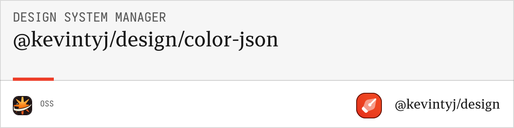

# @kevintyj/design-color-json

JSON generation utilities for design system colors. Converts color systems into various JSON formats including design tokens, Tailwind config, and Figma collections.

## 🎨 Features

- **Multiple JSON Formats** (flat, nested, tokens, Tailwind, collections)
- **Design Token Standard** compliance with W3C specification
- **Figma Collections** for seamless Figma integration
- **Tailwind Configuration** ready-to-use configs
- **Pretty Printing** for human-readable output
- **Metadata Inclusion** with generation timestamps
- **TypeScript Support** with full type definitions

## 📦 Installation

```bash
bun add @kevintyj/design-color-json
```

## 🚀 Quick Start

```typescript
import { generateJSONFiles } from '@kevintyj/design-color-json';
import { generateColorSystem } from '@kevintyj/design-color-core';

// Generate color system
const colorSystem = generateColorSystem(colorInput);

// Generate JSON files
const jsonFiles = generateJSONFiles(colorSystem, {
  format: 'all',
  prettyPrint: true,
  includeMetadata: true
});

// Write files to disk
jsonFiles.forEach(file => {
  console.log(`Generated: ${file.filename}`);
  console.log(`Type: ${file.format}`);
});
```

## 📖 API Reference

### Types

#### `JSONGenerationConfig`
```typescript
interface JSONGenerationConfig {
  format?: JSONFormat | 'all';     // Output format(s)
  prettyPrint?: boolean;           // Pretty print JSON (default: false)
  includeMetadata?: boolean;       // Include generation metadata (default: true)
  figmaCompatible?: boolean;       // Generate Figma-compatible format (default: false)
}
```

#### `JSONFormat`
```typescript
type JSONFormat = 
  | "flat"        // Flat key-value pairs
  | "nested"      // Nested object structure
  | "tokens"      // W3C Design Tokens format
  | "tailwind"    // Tailwind CSS config format
  | "collections"; // Figma collections format
```

#### `JSONFile`
```typescript
interface JSONFile {
  filename: string;
  content: string;
  format: JSONFormat;
  metadata?: {
    generatedAt: string;
    totalColors: number;
    format: string;
  };
}
```

### Functions

#### `generateJSONFiles(colorSystem, config?)`

Generates JSON files from a color system.

**Parameters:**
- `colorSystem: ColorSystem` - Generated color system
- `config?: JSONGenerationConfig` - Configuration options

**Returns:** `JSONFile[]`

#### `generateFlatJSON(colorSystem, config?)`

Generates flat key-value JSON format.

**Parameters:**
- `colorSystem: ColorSystem` - Generated color system
- `config?: JSONGenerationConfig` - Configuration options

**Returns:** `string`

#### `generateNestedJSON(colorSystem, config?)`

Generates nested object JSON format.

**Parameters:**
- `colorSystem: ColorSystem` - Generated color system
- `config?: JSONGenerationConfig` - Configuration options

**Returns:** `string`

#### `generateDesignTokensJSON(colorSystem, config?)`

Generates W3C Design Tokens format.

**Parameters:**
- `colorSystem: ColorSystem` - Generated color system
- `config?: JSONGenerationConfig` - Configuration options

**Returns:** `string`

#### `generateTailwindJSON(colorSystem, config?)`

Generates Tailwind CSS configuration format.

**Parameters:**
- `colorSystem: ColorSystem` - Generated color system
- `config?: JSONGenerationConfig` - Configuration options

**Returns:** `string`

#### `generateFigmaCollectionsJSON(colorSystem, config?)`

Generates Figma collections format.

**Parameters:**
- `colorSystem: ColorSystem` - Generated color system
- `config?: JSONGenerationConfig` - Configuration options

**Returns:** `string`

## 🎯 Output Formats

### Flat Format

Simple key-value pairs for easy integration:

```json
{
  "blue-1": "#fcfdff",
  "blue-2": "#f6f9ff",
  "blue-12": "#113161",
  "blue-a1": "rgba(40, 110, 220, 0.05)",
  "blue-a12": "rgba(40, 110, 220, 0.95)",
  "blue-contrast": "#ffffff",
  "blue-surface": "rgba(40, 110, 220, 0.1)"
}
```

### Nested Format

Organized object structure:

```json
{
  "colors": {
    "blue": {
      "1": "#fcfdff",
      "2": "#f6f9ff",
      "12": "#113161",
      "alpha": {
        "1": "rgba(40, 110, 220, 0.05)",
        "12": "rgba(40, 110, 220, 0.95)"
      },
      "special": {
        "contrast": "#ffffff",
        "surface": "rgba(40, 110, 220, 0.1)"
      }
    }
  }
}
```

### Design Tokens Format

W3C Design Tokens specification:

```json
{
  "color": {
    "blue": {
      "1": {
        "value": "#fcfdff",
        "type": "color",
        "description": "Subtle background"
      },
      "contrast": {
        "value": "#ffffff", 
        "type": "color",
        "description": "High contrast text"
      }
    }
  }
}
```

### Tailwind Config Format

Ready-to-use Tailwind configuration:

```json
{
  "theme": {
    "extend": {
      "colors": {
        "blue": {
          "50": "#fcfdff",
          "100": "#f6f9ff",
          "500": "#286edc",
          "950": "#113161"
        }
      }
    }
  }
}
```

### Figma Collections Format

Figma-compatible variable collections:

```json
{
  "collections": [
    {
      "name": "Colors",
      "modes": [
        { "name": "Light", "modeId": "light" },
        { "name": "Dark", "modeId": "dark" }
      ],
      "variables": [
        {
          "name": "blue/1",
          "type": "COLOR",
          "values": {
            "light": "#fcfdff",
            "dark": "#0d1520"
          }
        }
      ]
    }
  ]
}
```

## 💡 Usage Examples

### Generate All Formats

```typescript
import { generateJSONFiles } from '@kevintyj/design-color-json';

const jsonFiles = generateJSONFiles(colorSystem, {
  format: 'all',
  prettyPrint: true
});

// Outputs:
// - colors-flat.json
// - colors-nested.json  
// - colors-tokens.json
// - colors-tailwind.json
// - colors-collections.json
```

### Specific Format

```typescript
const jsonFiles = generateJSONFiles(colorSystem, {
  format: 'tailwind',
  prettyPrint: true
});

// Outputs:
// - colors-tailwind.json
```

### Figma Integration

```typescript
const jsonFiles = generateJSONFiles(colorSystem, {
  format: 'collections',
  figmaCompatible: true,
  prettyPrint: true
});

// Optimized for Figma import
```

### Custom Configuration

```typescript
const jsonFiles = generateJSONFiles(colorSystem, {
  format: 'tokens',
  prettyPrint: false,       // Minified output
  includeMetadata: false    // No metadata
});
```

### Individual Format Generation

```typescript
import { 
  generateFlatJSON,
  generateTailwindJSON,
  generateDesignTokensJSON 
} from '@kevintyj/design-color-json';

// Generate specific formats
const flatColors = generateFlatJSON(colorSystem);
const tailwindConfig = generateTailwindJSON(colorSystem);
const designTokens = generateDesignTokensJSON(colorSystem);
```

## 🛠 Integration Examples

### With Tailwind CSS

```typescript
import { generateTailwindJSON } from '@kevintyj/design-color-json';

const tailwindConfig = JSON.parse(generateTailwindJSON(colorSystem));

// tailwind.config.js
module.exports = {
  ...tailwindConfig,
  content: ['./src/**/*.{js,ts,jsx,tsx}'],
  // ... other config
};
```

### With Style Dictionary

```typescript
import { generateDesignTokensJSON } from '@kevintyj/design-color-json';

const tokens = JSON.parse(generateDesignTokensJSON(colorSystem));

// Use with Style Dictionary for multi-platform output
```

### With Figma Plugin

```typescript
import { generateFigmaCollectionsJSON } from '@kevintyj/design-color-json';

const collections = JSON.parse(generateFigmaCollectionsJSON(colorSystem, {
  figmaCompatible: true
}));

// Import into Figma via plugin API
```

### With Build Tools

```typescript
import { writeFileSync } from 'fs';
import { generateJSONFiles } from '@kevintyj/design-color-json';

const jsonFiles = generateJSONFiles(colorSystem, {
  format: 'all',
  prettyPrint: process.env.NODE_ENV === 'development'
});

jsonFiles.forEach(file => {
  writeFileSync(`./dist/json/${file.filename}`, file.content);
});
```

## 🎯 Format Comparison

| Format | Use Case | Structure | Integration |
|--------|----------|-----------|-------------|
| **Flat** | Simple integrations | Key-value pairs | Easy parsing |
| **Nested** | Complex applications | Organized objects | Tree structure |
| **Tokens** | Design systems | W3C standard | Cross-platform |
| **Tailwind** | Tailwind CSS | Config format | Direct import |
| **Collections** | Figma workflows | Variable collections | Figma plugins |

## 🧪 Testing

```bash
# Run tests
bun test

# Test all formats
bun test --coverage

# Watch mode
bun test --watch
```

## 🛠 Development

```bash
# Install dependencies
bun install

# Build the package
bun run build

# Run linting
bun run lint

# Format code
bun run format
```

## 📊 Output Metadata

Generated files include rich metadata:

```json
{
  "metadata": {
    "generatedAt": "2024-01-01T12:00:00.000Z",
    "totalColors": 9,
    "format": "tailwind",
    "generator": "@kevintyj/design-color-json",
    "version": "1.0.0"
  }
}
```

## 🤝 Related Packages

- **[@kevintyj/design-color-core](../color-generation-core)** - Core color generation
- **[@kevintyj/design-color-css](../color-generation-css)** - CSS output generation
- **[@kevintyj/design/cli](../cli)** - Command-line interface

## 📄 License

MIT License - see the [LICENSE](../../LICENSE) file for details. 