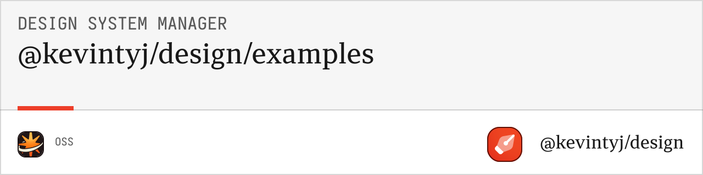

# @kevintyj/design/examples

Usage examples and demos for the design system generation packages. Learn how to use the color and spacing generation systems with practical examples.

## 🎯 Features

- **Basic Examples** for getting started quickly
- **Advanced Usage** patterns and configurations
- **Integration Examples** with popular frameworks
- **Real-world Scenarios** and use cases
- **Performance Demonstrations** and benchmarks
- **TypeScript Examples** with full type safety

## 📦 Installation

```bash
bun add @kevintyj/design/examples
```

## 🚀 Available Examples

### Basic Examples

#### `basic.ts`
Demonstrates fundamental color and spacing generation:

```bash
bun packages/examples/src/basic.ts
```

**What it covers:**
- Loading color definitions from `base.ts`
- Generating complete color systems
- Creating CSS and JSON outputs
- Basic spacing generation (coming soon)

#### `color-only.ts`
Focused on color generation only:

```bash
bun packages/examples/src/color-only.ts
```

**What it covers:**
- Color system generation
- Multiple output formats
- Custom configurations
- Validation and debugging

### Advanced Examples

#### `advanced.ts`
Complex scenarios and optimizations:

```bash
bun packages/examples/src/advanced.ts
```

**What it covers:**
- Custom color configurations
- Performance optimizations
- Error handling patterns
- Integration with build tools

#### `custom-config.ts`
Custom configuration examples:

```bash
bun packages/examples/src/custom-config.ts
```

**What it covers:**
- Custom CSS prefixes
- Selective feature generation
- Output directory organization
- Metadata management

### Integration Examples

#### `figma-integration.ts`
Figma plugin and variable examples:

```bash
bun packages/examples/src/figma-integration.ts
```

**What it covers:**
- Figma collections generation
- Variable format conversion
- Plugin-ready outputs
- Cross-platform compatibility

#### `build-tools.ts`
Build system integration examples:

```bash
bun packages/examples/src/build-tools.ts
```

**What it covers:**
- Webpack integration
- Vite plugin usage
- PostCSS processing
- CI/CD automation

## 🎨 Example Outputs

### Basic Color Generation

```typescript
// basic.ts example
import { loadColorDefinitions, generateColorSystem } from '@kevintyj/design/color-generation-core';
import { generateCSSFiles } from '@kevintyj/design/color-generation-css';

const colorInput = await loadColorDefinitions('./base.ts');
const colorSystem = generateColorSystem(colorInput);
const cssFiles = generateCSSFiles(colorSystem);

console.log(`Generated ${cssFiles.length} CSS files`);
cssFiles.forEach(file => {
  console.log(`- ${file.filename} (${file.content.length} bytes)`);
});
```

### Custom Configuration

```typescript
// custom-config.ts example
const colorSystem = generateColorSystem(colorInput, {
  includeAlpha: false,      // Skip alpha variants
  includeWideGamut: false,  // Skip P3 colors
  includeGrayScale: true,   // Include gray scales
  includeOverlays: false    // Skip overlay colors
});

const cssFiles = generateCSSFiles(colorSystem, {
  cssPrefix: '--theme',
  outputVariant: 'combined'
});
```

### JSON Generation

```typescript
// json-formats.ts example
import { generateJSONFiles } from '@kevintyj/design/color-generation-json';

const jsonFiles = generateJSONFiles(colorSystem, {
  format: 'all',
  prettyPrint: true,
  includeMetadata: true
});

jsonFiles.forEach(file => {
  console.log(`Generated ${file.filename} in ${file.format} format`);
});
```

## 🛠 Running Examples

### Individual Examples

```bash
# Run basic example
bun run example:basic

# Run advanced example  
bun run example:advanced

# Run specific example file
bun packages/examples/src/figma-integration.ts
```

### With Custom Configuration

```bash
# Run with custom base.ts file
BASE_FILE=./my-colors.ts bun packages/examples/src/basic.ts

# Run with custom output directory
OUTPUT_DIR=./my-output bun packages/examples/src/basic.ts
```

### Development Mode

```bash
# Watch mode for development
bun --watch packages/examples/src/basic.ts

# Debug mode with verbose output
DEBUG=true bun packages/examples/src/advanced.ts
```

## 📊 Performance Examples

### Benchmark Generation

```typescript
// performance.ts example
console.time('Color System Generation');

const colorInput = await loadColorDefinitions('./base.ts');
const colorSystem = generateColorSystem(colorInput);

console.timeEnd('Color System Generation');

console.time('CSS Generation');
const cssFiles = generateCSSFiles(colorSystem);
console.timeEnd('CSS Generation');

console.time('JSON Generation');
const jsonFiles = generateJSONFiles(colorSystem);
console.timeEnd('JSON Generation');
```

### Memory Usage

```typescript
// memory-usage.ts example
const memBefore = process.memoryUsage();

const colorSystem = generateColorSystem(colorInput);
const cssFiles = generateCSSFiles(colorSystem);
const jsonFiles = generateJSONFiles(colorSystem);

const memAfter = process.memoryUsage();
console.log('Memory usage:', {
  heapUsed: `${Math.round((memAfter.heapUsed - memBefore.heapUsed) / 1024 / 1024)} MB`,
  rss: `${Math.round((memAfter.rss - memBefore.rss) / 1024 / 1024)} MB`
});
```

## 🧪 Testing Examples

```bash
# Test all examples
bun test packages/examples/

# Test specific example
bun test packages/examples/src/basic.test.ts

# Run examples as tests
bun test:examples
```

## 🎯 Example Categories

### 1. Getting Started
- **basic.ts**: Essential functionality
- **validation.ts**: Input validation
- **file-loading.ts**: Loading from files

### 2. Color Generation
- **color-scales.ts**: Color scale generation
- **alpha-variants.ts**: Alpha channel handling
- **wide-gamut.ts**: P3 color support
- **gray-scales.ts**: Contextual grays

### 3. Output Formats
- **css-generation.ts**: CSS custom properties
- **json-formats.ts**: Multiple JSON formats
- **tailwind-config.ts**: Tailwind integration
- **figma-export.ts**: Figma compatibility

### 4. Advanced Usage
- **custom-themes.ts**: Theme generation
- **performance.ts**: Optimization techniques
- **error-handling.ts**: Robust error handling
- **streaming.ts**: Large-scale processing

### 5. Integration
- **react-integration.ts**: React/Next.js usage
- **vue-integration.ts**: Vue.js integration
- **build-process.ts**: Build tool integration
- **ci-cd.ts**: Continuous integration

## 💡 Learning Path

### Beginner
1. Start with `basic.ts` to understand core concepts
2. Try `validation.ts` to learn input validation
3. Explore `css-generation.ts` for output formats

### Intermediate
1. Study `advanced.ts` for complex configurations
2. Learn `figma-integration.ts` for design workflows
3. Practice `custom-config.ts` for customization

### Advanced
1. Master `performance.ts` for optimization
2. Implement `build-tools.ts` patterns
3. Create custom examples for your use case

## 🛠 Development

```bash
# Install dependencies
bun install

# Build examples
bun run build

# Run linting
bun run lint

# Format code
bun run format
```

### Creating New Examples

1. Create a new `.ts` file in `src/`
2. Follow the existing pattern:
   - Import necessary packages
   - Load or create test data
   - Demonstrate specific functionality
   - Show results with console output

```typescript
// new-example.ts template
import { generateColorSystem } from '@kevintyj/design/color-generation-core';

console.log('🎨 New Example: [Description]');

// Your example code here
const result = generateColorSystem(/* ... */);

console.log('✅ Example completed');
console.log(`Generated: ${result.metadata.totalScales} color scales`);
```

## 🤝 Related Packages

- **[@kevintyj/design/color-generation-core](../color-generation-core)** - Core color generation
- **[@kevintyj/design/color-generation-css](../color-generation-css)** - CSS output generation
- **[@kevintyj/design/color-generation-json](../color-generation-json)** - JSON output generation
- **[@kevintyj/design/spacing-generation-core](../spacing-generation-core)** - Core spacing generation
- **[@kevintyj/design/cli](../cli)** - Command-line interface

## 📄 License

MIT License - see the [LICENSE](../../LICENSE) file for details. 