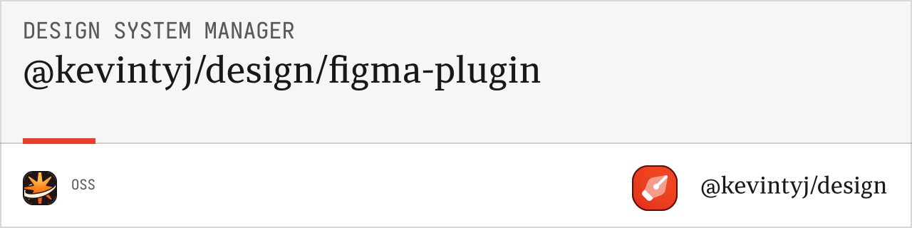

# Design System Manager | @kevintyj/design/figma-plugin

[**Figma plugin**](https://www.figma.com/community/plugin/1525022875622896761/design-system-manager-kevintyj-design)

Figma plugin for design system management. Generate, import, and manage color and spacing systems directly within Figma using the design system generation tools.

## 🎨 Features

<p align="center">
  
</p>

[Youtube Demo](https://www.youtube.com/watch?v=RBG1NTVvytk)


- **Color System Import** from base.ts configuration files
- **Spacing System Import** with utility class generation
- **Interactive UI** with React and TypeScript
- **Variable Management** with automatic collection creation
- **Real-time Preview** of generated color and spacing scales
- **Export Capabilities** to multiple formats (CSS, JSON, Figma variables)
- **Validation Tools** for color and spacing definitions
- **Performance Optimized** for large design systems
- **Light/Dark Mode Support** with theme switching
- **TypeScript Support** with full type safety

## 📦 Installation

### Development Setup

```bash
# Install dependencies
bun install

# Start development mode with hot reload
bun run dev

# Build for production
bun run build

# Type checking
bun run type-check

# Linting and formatting
bun run lint
bun run format
```

### Plugin Installation

1. **Build the plugin**: `bun run build`
2. **Open Figma Desktop App** (required for plugin development)
3. Go to **Plugins** → **Development** → **Import plugin from manifest**
4. Select the `manifest.json` file from this package
5. The plugin will appear in your plugins list as "Design System Manager"

### Production Installation (Future)

1. Open Figma
2. Go to **Plugins** → **Browse plugins in Community**
3. Search for "Design System Manager"
4. Click **Install** and then **Run**

## 🚀 Quick Start

### Basic Usage

1. **Open the Plugin**: Plugins → Development → Design System Manager
2. **Configure Tab**: Upload or paste your `base.ts` configuration
3. **Generate Colors**: Click "Generate Color System" to see preview
4. **Generate Spacing**: Click "Generate Spacing System" for spacing values
5. **Variables Tab**: Create Figma variables from your design system
6. **Export Tab**: Export to CSS, JSON, or Figma format

### Configuration Format

The plugin expects a `base.ts` file with this structure:

#### Color Configuration

```typescript
// base.ts
export const light = {
  primary: '#0066CC',
  secondary: '#6366F1',
  success: '#059669',
  warning: '#D97706',
  danger: '#DC2626',
  // ... more colors
};

export const dark = {
  primary: '#3B82F6',
  secondary: '#8B5CF6',
  success: '#10B981',
  warning: '#F59E0B',
  danger: '#EF4444',
  // ... more colors
};

export const constantsLight = {
  gray: '#6B7280',
  background: '#FFFFFF',
  foreground: '#111827'
};

export const constantsDark = {
  gray: '#9CA3AF',
  background: '#111827',
  foreground: '#F9FAFB'
};
```

#### Spacing Configuration

```typescript
// base.ts (continued)
export const spacing = {
  "0": 0,
  "px": 1,
  "2px": 2,
  "3px": 3,
  "1": 4,
  "5px": 5,
  "6px": 6,
  "2": 8,
  "10px": 10,
  "3": 12,
  "14px": 14,
  "4": 16,
  "5": 20,
  "6": 24,
  "7": 28,
  "8": 32,
  "9": 36,
  "10": 40,
  "11": 44,
  "12": 48,
  "13": 52,
  "14": 56,
  "15": 60,
  "16": 64,
  "18": 72,
  "20": 80
};

export const spacingMultiplier = 4;
```

## 🎯 Plugin Interface

### Main Tabs

#### 1. Configure Tab

**Features:**
- **File Upload**: Drag & drop `base.ts` files or browse to select
- **Manual Input**: Paste configuration directly into code editor
- **Syntax Highlighting**: TypeScript/JavaScript code highlighting
- **Real-time Validation**: Immediate feedback on configuration errors
- **Preview**: See color scales and spacing values before generation

**Usage:**
```typescript
// Upload your base.ts file or paste configuration
// The plugin will automatically validate and show preview
```

#### 2. Variables Tab

**Features:**
- **Collection Management**: Create and manage variable collections
- **Mode Setup**: Configure light/dark modes for color variables
- **Batch Import**: Import all colors and spacing as Figma variables
- **Naming Options**: Customize variable naming conventions
- **Variable Types**: Support for color, number (spacing), and string variables

**Usage:**
1. Generate your design system in the Configure tab
2. Switch to Variables tab
3. Choose collection names and modes
4. Click "Create Variables" to import into Figma

#### 3. Export Tab

**Features:**
- **Format Selection**: Choose CSS, JSON, or Figma formats
- **Download Options**: Export generated files to your computer
- **Copy to Clipboard**: Quick copying for small exports
- **Batch Export**: Export multiple formats at once
- **Preview**: See generated content before exporting

**Supported Formats:**
- **CSS**: Custom properties, utility classes, light/dark modes
- **JSON**: Flat, nested, tokens, Tailwind configurations
- **Figma**: Variable collections, design token formats

#### 4. Preferences Tab

**Features:**
- **Color Settings**: Configure generation options (alpha, P3, gray scales)
- **Spacing Settings**: Configure utility classes, REM values, negative margins
- **UI Preferences**: Plugin theme, layout, and display options
- **Performance**: Optimize for large color systems
- **Sync Settings**: Save preferences across plugin sessions

### Advanced Features

#### Real-time Preview

```typescript
// The plugin shows live previews of:
// - Color scales (1-12 steps)
// - Alpha variants
// - P3 wide gamut colors
// - Spacing values with visual representation
// - Generated CSS/JSON output
```

#### Variable Integration

```typescript
// Automatically creates Figma variables:
// - Color variables with light/dark modes
// - Spacing variables as numbers
// - Proper collection organization
// - Semantic naming conventions
```

#### Export Integration

```typescript
// Export capabilities:
// - Multiple format support
// - Batch operations
// - File organization
// - Compressed downloads
```

## 📖 Plugin Components

### ConfigureTab Component

**Purpose:** Handle configuration input and validation

```typescript
interface ConfigureTabProps {
  onConfigurationChange: (config: ColorInput & SpacingInput) => void;
  currentConfig?: ColorInput & SpacingInput;
  validationErrors?: ValidationError[];
}
```

**Features:**
- File dropzone for `base.ts` uploads
- Code editor with syntax highlighting and error detection
- Real-time validation feedback with detailed error messages
- Color and spacing preview grid with visual scales
- Import/export configuration presets

### VariablesTab Component

**Purpose:** Manage Figma variable creation and organization

```typescript
interface VariablesTabProps {
  colorSystem?: ColorSystem;
  spacingSystem?: SpacingSystem;
  onVariablesCreated: (result: VariableCreationResult) => void;
}
```

**Features:**
- Variable collection creation with proper naming
- Light/dark mode management for color variables
- Batch variable import with progress tracking
- Naming pattern configuration (prefix, suffix, case)
- Variable organization and grouping

### ExportTab Component

**Purpose:** Handle exporting to various formats

```typescript
interface ExportTabProps {
  colorSystem?: ColorSystem;
  spacingSystem?: SpacingSystem;
  generatedFiles: GeneratedFile[];
  onExport: (format: ExportFormat, options: ExportOptions) => void;
}
```

**Features:**
- Multiple export format selection
- Download management with progress indicators
- Preview before export with syntax highlighting
- Compression options for large exports
- Batch export with ZIP file creation

### PreferencesTab Component

**Purpose:** Manage plugin settings and preferences

```typescript
interface PreferencesTabProps {
  preferences: PluginPreferences;
  onPreferencesChange: (preferences: PluginPreferences) => void;
}
```

**Features:**
- Generation settings (colors: alpha, P3, gray scales)
- Spacing settings (utilities, REM, negative margins)
- UI preferences (theme, layout, density)
- Performance optimization settings
- Import/export preferences

## 🛠 Development

### Project Structure

```
src/
├── components/           # React components
│   ├── ConfigureTab.tsx  # Configuration input
│   ├── VariablesTab.tsx  # Variable management
│   ├── ExportTab.tsx     # Export functionality
│   ├── PreferencesTab.tsx # Settings and preferences
│   ├── FileDropzone.tsx  # File upload component
│   ├── GeneratedColorTable.tsx # Color preview
│   ├── StatusMessage.tsx # Status and feedback
│   └── SystemManagerPlugin.tsx # Main plugin container
├── hooks/               # Custom React hooks
│   ├── useFileHandling.ts # File upload/parsing
│   ├── usePluginMessaging.ts # Figma API communication
│   ├── useColorGeneration.ts # Color system generation
│   └── useSpacingGeneration.ts # Spacing system generation
├── utils/               # Utility functions
│   ├── constants.ts     # Plugin constants and config
│   ├── download.ts      # File download utilities
│   ├── validation.ts    # Input validation
│   └── figmaApi.ts      # Figma API helpers
├── types/               # TypeScript type definitions
│   └── index.ts         # Plugin-specific types
├── code.ts              # Figma plugin backend code
├── ui.tsx               # React UI entry point
├── ui.css               # Plugin styles
└── ui.html              # HTML template
```

### Build System

The plugin uses a custom Webpack configuration optimized for Figma:

```bash
# Development with hot reload
bun run dev

# Production build with optimization
bun run build

# Type checking
bun run type-check

# Linting with ESLint
bun run lint

# Code formatting with Prettier
bun run format
```

### Webpack Configuration

```javascript
// webpack.config.js - optimized for Figma plugin development
module.exports = {
  entry: {
    ui: './src/ui.tsx',        // Plugin UI
    code: './src/code.ts'      // Plugin backend
  },
  output: {
    filename: '[name].js',
    path: path.resolve(__dirname, 'dist')
  },
  // ... Figma-specific optimizations
};
```

### Plugin Manifest

```json
{
  "name": "Design System Manager",
  "id": "design-system-manager",
  "api": "1.0.0",
  "main": "dist/code.js",
  "ui": "dist/ui.html",
  "capabilities": ["read", "write"],
  "permissions": ["currentuser"],
  "networkAccess": {
    "allowedDomains": ["none"]
  }
}
```

## 🎨 Plugin API

### Color System Integration

```typescript
// Generate color system within plugin
import { generateColorSystem } from '@kevintyj/design-color-core';

const colorSystem = generateColorSystem(colorInput, {
  includeAlpha: preferences.includeAlpha,
  includeWideGamut: preferences.includeWideGamut,
  includeGrayScale: preferences.includeGrayScale
});

// Create Figma variables
await createColorVariables(colorSystem, {
  collectionName: 'Design System Colors',
  modes: ['Light', 'Dark']
});
```

### Spacing System Integration

```typescript
// Generate spacing system within plugin
import { generateSpacingSystem } from '@kevintyj/design-spacing-core';

const spacingSystem = generateSpacingSystem(spacingInput, {
  generateRem: preferences.generateRem,
  remBase: preferences.remBase
});

// Create Figma variables
await createSpacingVariables(spacingSystem, {
  collectionName: 'Design System Spacing'
});
```

### Export Integration

```typescript
// Export to multiple formats
import { generateCSSFiles } from '@kevintyj/design-color-css';
import { generateJSONFiles } from '@kevintyj/design-color-json';

const cssFiles = generateCSSFiles(colorSystem, exportOptions.css);
const jsonFiles = generateJSONFiles(colorSystem, exportOptions.json);

// Download files
await downloadFiles([...cssFiles, ...jsonFiles]);
```

## 💡 Usage Examples

### Basic Color System Setup

1. **Prepare Configuration:**
```typescript
// base.ts
export const light = {
  brand: '#0066CC',
  accent: '#6366F1'
};

export const dark = {
  brand: '#3B82F6', 
  accent: '#8B5CF6'
};
```

2. **Import into Plugin:**
   - Open plugin in Figma
   - Go to Configure tab
   - Upload base.ts file or paste content
   - See real-time preview of color scales

3. **Create Variables:**
   - Switch to Variables tab
   - Choose collection name: "Brand Colors"
   - Set modes: "Light" and "Dark"
   - Click "Create Variables"

4. **Export System:**
   - Go to Export tab
   - Select CSS and JSON formats
   - Configure export options
   - Download generated files

### Advanced Spacing Setup

1. **Prepare Spacing Configuration:**
```typescript
// base.ts
export const spacing = {
  "0": 0,
  "1": 4,
  "2": 8,
  "4": 16,
  "8": 32
};

export const spacingMultiplier = 4;
```

2. **Generate with Utilities:**
   - Configure preferences to include utility classes
   - Generate spacing system with REM values
   - Create Figma variables for spacing
   - Export CSS with utility classes

### Plugin Development Workflow

1. **Development Setup:**
```bash
# Clone repository
git clone <repository>
cd packages/figma-plugin

# Install dependencies
bun install

# Start development
bun run dev
```

2. **Testing in Figma:**
   - Import plugin from manifest
   - Test with sample configurations
   - Verify variable creation
   - Test export functionality

3. **Building for Production:**
```bash
# Build optimized version
bun run build

# Verify output
ls -la dist/
```

## 🔧 Configuration Options

### Plugin Preferences

```typescript
interface PluginPreferences {
  // Color generation
  includeAlpha: boolean;
  includeWideGamut: boolean;
  includeGrayScale: boolean;
  
  // Spacing generation
  generateRem: boolean;
  remBase: number;
  includeNegative: boolean;
  
  // UI preferences
  theme: 'light' | 'dark' | 'auto';
  density: 'compact' | 'normal' | 'comfortable';
  
  // Performance
  maxColors: number;
  batchSize: number;
}
```

### Export Options

```typescript
interface ExportOptions {
  css: {
    includeAlpha: boolean;
    includeWideGamut: boolean;
    generateUtilityClasses: boolean;
    cssPrefix: string;
  };
  
  json: {
    format: 'flat' | 'nested' | 'tokens' | 'tailwind';
    prettyPrint: boolean;
  };
  
  figma: {
    format: 'collections' | 'variables';
    includeMetadata: boolean;
  };
}
```

## 🧪 Testing

### Unit Testing

```typescript
// Test color generation
import { generateColorSystem } from '@kevintyj/design-color-core';

const testInput = {
  light: { test: '#FF0000' },
  dark: { test: '#FF6666' },
  constants: { /* ... */ }
};

const system = generateColorSystem(testInput);
console.assert(system.colorNames.includes('test'));
```

### Integration Testing

```bash
# Test plugin build
bun run build

# Verify manifest
node scripts/validate-manifest.js

# Test in Figma
# (Manual testing required)
```

### End-to-End Testing

1. **Configuration Testing:**
   - Upload various base.ts files
   - Test validation error handling
   - Verify preview generation

2. **Variable Creation Testing:**
   - Test collection creation
   - Verify mode setup
   - Test batch variable import

3. **Export Testing:**
   - Test all export formats
   - Verify file downloads
   - Test batch exports

## 🤝 Related Packages

- **[@kevintyj/design-color-core](../color-generation-core)** - Core color generation logic
- **[@kevintyj/design-spacing-core](../spacing-generation-core)** - Core spacing generation logic
- **[@kevintyj/design-color-css](../color-generation-css)** - CSS output generation
- **[@kevintyj/design-color-json](../color-generation-json)** - JSON output generation
- **[@kevintyj/design/cli](../cli)** - Command-line interface

## 🔮 Roadmap

- ✅ Color system generation and management
- ✅ Spacing system generation and management
- ✅ Variable creation and organization
- ✅ Multiple export formats
- 🚧 Typography scale integration
- 🚧 Component token generation
- 🚧 Design token standard compliance
- 🚧 Team library integration
- 🚧 Version control and history
- 🚧 Collaborative editing features

## 📄 License

MIT License - see the [LICENSE](../../LICENSE) file for details.

## 🙏 Acknowledgments

- [Figma Plugin API](https://www.figma.com/plugin-docs/) for the platform
- [React](https://reactjs.org/) for the UI framework
- [TypeScript](https://www.typescriptlang.org/) for type safety
- All contributors to this design system project 