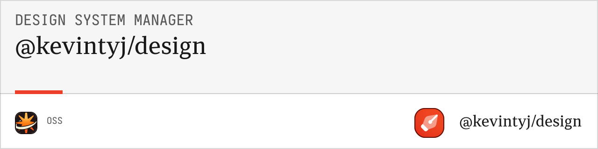

# @kevintyj/design/figma-to-json

Export Figma variables and design tokens to JSON format. Convert Figma variable collections into design system compatible JSON files for use with build tools and development workflows.

## 🎨 Features

- **Variable Collection Export** from Figma files
- **Multiple JSON Formats** (flat, nested, tokens, Tailwind)
- **Design Token Compatibility** with W3C specification
- **Batch Processing** for multiple collections
- **Type Safety** with full TypeScript support
- **Metadata Preservation** from Figma variables
- **Framework Integration** ready outputs

## 📦 Installation

```bash
bun add @kevintyj/design/figma-to-json
```

## 🚀 Quick Start

### Using with Figma Plugin API

```typescript
import { exportVariablesToJSON } from '@kevintyj/design/figma-to-json';

// In a Figma plugin
const collections = figma.variables.getLocalVariableCollections();
const jsonFiles = await exportVariablesToJSON(collections, {
  format: 'all',
  prettyPrint: true
});

jsonFiles.forEach(file => {
  console.log(`Generated: ${file.filename}`);
});
```

### Using with Exported Data

```typescript
import { convertFigmaVariables } from '@kevintyj/design/figma-to-json';

// With exported Figma variable data
const figmaData = {
  collections: [...],
  variables: [...],
  modes: [...]
};

const result = convertFigmaVariables(figmaData, {
  format: 'tokens',
  includeMetadata: true
});
```

## 📖 API Reference

### Types

#### `FigmaExportConfig`
```typescript
interface FigmaExportConfig {
  format?: JSONFormat | 'all';     // Output format(s)
  prettyPrint?: boolean;           // Pretty print JSON (default: false)
  includeMetadata?: boolean;       // Include Figma metadata (default: true)
  filterCollections?: string[];    // Collection names to include
  colorFormat?: ColorFormat;       // Color value format
  groupByCollection?: boolean;     // Group variables by collection
}
```

#### `JSONFormat`
```typescript
type JSONFormat = 
  | "flat"        // Flat key-value pairs
  | "nested"      // Nested object structure
  | "tokens"      // W3C Design Tokens format
  | "tailwind"    // Tailwind CSS config format
  | "collections"; // Figma collections structure
```

#### `ColorFormat`
```typescript
type ColorFormat = 
  | "hex"         // #FF0000
  | "rgb"         // rgb(255, 0, 0)
  | "rgba"        // rgba(255, 0, 0, 1)
  | "hsl"         // hsl(0, 100%, 50%)
  | "oklch";      // oklch(0.7 0.2 0)
```

#### `ExportedFile`
```typescript
interface ExportedFile {
  filename: string;
  content: string;
  format: JSONFormat;
  metadata: {
    sourceCollection: string;
    exportedAt: string;
    variableCount: number;
  };
}
```

### Functions

#### `exportVariablesToJSON(collections, config?)`

Exports Figma variable collections to JSON format.

**Parameters:**
- `collections: VariableCollection[]` - Figma variable collections
- `config?: FigmaExportConfig` - Export configuration

**Returns:** `Promise<ExportedFile[]>`

#### `convertFigmaVariables(figmaData, config?)`

Converts Figma variable data to design system format.

**Parameters:**
- `figmaData: FigmaVariableData` - Exported Figma variable data
- `config?: FigmaExportConfig` - Conversion configuration

**Returns:** `string`

#### `parseVariableCollection(collection)`

Parses a single Figma variable collection.

**Parameters:**
- `collection: VariableCollection` - Figma variable collection

**Returns:** `ParsedCollection`

## 🎯 Output Formats

### Flat Format

Simple key-value pairs:

```json
{
  "primary-50": "#eff6ff",
  "primary-500": "#3b82f6",
  "primary-900": "#1e3a8a",
  "spacing-xs": "4px",
  "spacing-sm": "8px",
  "spacing-md": "16px"
}
```

### Nested Format

Organized by type and collection:

```json
{
  "colors": {
    "primary": {
      "50": "#eff6ff",
      "500": "#3b82f6",
      "900": "#1e3a8a"
    }
  },
  "spacing": {
    "xs": "4px",
    "sm": "8px",
    "md": "16px"
  }
}
```

### Design Tokens Format

W3C Design Tokens specification:

```json
{
  "color": {
    "primary": {
      "50": {
        "value": "#eff6ff",
        "type": "color",
        "description": "Primary color light variant"
      },
      "500": {
        "value": "#3b82f6", 
        "type": "color",
        "description": "Primary brand color"
      }
    }
  },
  "spacing": {
    "xs": {
      "value": "4px",
      "type": "dimension",
      "description": "Extra small spacing"
    }
  }
}
```

### Tailwind Format

Ready-to-use Tailwind configuration:

```json
{
  "theme": {
    "extend": {
      "colors": {
        "primary": {
          "50": "#eff6ff",
          "500": "#3b82f6",
          "900": "#1e3a8a"
        }
      },
      "spacing": {
        "xs": "4px",
        "sm": "8px",
        "md": "16px"
      }
    }
  }
}
```

### Collections Format

Preserves Figma collection structure:

```json
{
  "collections": [
    {
      "name": "Design System",
      "id": "VariableCollectionId:123",
      "modes": [
        { "name": "Light", "modeId": "456" },
        { "name": "Dark", "modeId": "789" }
      ],
      "variables": [
        {
          "name": "primary/500",
          "type": "COLOR",
          "id": "VariableID:abc",
          "values": {
            "456": "#3b82f6",
            "789": "#1d4ed8"
          }
        }
      ]
    }
  ]
}
```

## 💡 Usage Examples

### Export All Collections

```typescript
import { exportVariablesToJSON } from '@kevintyj/design/figma-to-json';

// Export all variable collections
const collections = figma.variables.getLocalVariableCollections();
const exports = await exportVariablesToJSON(collections, {
  format: 'all',
  prettyPrint: true
});
```

### Filter Specific Collections

```typescript
const exports = await exportVariablesToJSON(collections, {
  format: 'tokens',
  filterCollections: ['Design System', 'Brand Colors'],
  includeMetadata: true
});
```

### Custom Color Format

```typescript
const exports = await exportVariablesToJSON(collections, {
  format: 'flat',
  colorFormat: 'rgba',
  prettyPrint: true
});
```

### Tailwind Integration

```typescript
const tailwindConfig = await exportVariablesToJSON(collections, {
  format: 'tailwind',
  groupByCollection: false  // Flatten all variables
});

// Use in tailwind.config.js
module.exports = {
  ...JSON.parse(tailwindConfig[0].content),
  content: ['./src/**/*.{js,ts,jsx,tsx}']
};
```

### Batch Processing

```typescript
import { processMultipleFiles } from '@kevintyj/design/figma-to-json';

const figmaFiles = [
  { id: 'file1', collections: [...] },
  { id: 'file2', collections: [...] }
];

const allExports = await processMultipleFiles(figmaFiles, {
  format: 'nested',
  includeMetadata: true
});
```

## 🛠 Integration Examples

### With Build Tools

```typescript
// build-script.ts
import { exportVariablesToJSON } from '@kevintyj/design/figma-to-json';
import { writeFileSync } from 'fs';

async function buildDesignTokens() {
  const collections = await getFigmaCollections(); // Your Figma API call
  const exports = await exportVariablesToJSON(collections, {
    format: 'tokens',
    prettyPrint: true
  });

  exports.forEach(file => {
    writeFileSync(`./tokens/${file.filename}`, file.content);
  });
}
```

### With CI/CD

```yaml
# .github/workflows/design-tokens.yml
name: Export Design Tokens
on:
  schedule:
    - cron: '0 9 * * 1' # Every Monday at 9 AM

jobs:
  export-tokens:
    runs-on: ubuntu-latest
    steps:
      - uses: actions/checkout@v3
      - uses: oven-sh/setup-bun@v1
      
      - name: Export Figma Variables
        run: |
          bun install
          bun run export-figma-variables
        env:
          FIGMA_TOKEN: ${{ secrets.FIGMA_TOKEN }}
          
      - name: Commit Changes
        run: |
          git config --global user.name 'Design Token Bot'
          git add tokens/
          git commit -m 'Update design tokens from Figma'
          git push
```

### With Style Dictionary

```typescript
// style-dictionary.config.js
import { exportVariablesToJSON } from '@kevintyj/design/figma-to-json';

const figmaTokens = await exportVariablesToJSON(collections, {
  format: 'tokens'
});

export default {
  source: ['tokens/**/*.json'],
  platforms: {
    css: {
      transformGroup: 'css',
      buildPath: 'dist/css/',
      files: [{
        destination: 'variables.css',
        format: 'css/variables'
      }]
    },
    js: {
      transformGroup: 'js',
      buildPath: 'dist/js/',
      files: [{
        destination: 'tokens.js',
        format: 'javascript/module'
      }]
    }
  }
};
```

### With Figma Plugin

```typescript
// In a Figma plugin
figma.ui.onmessage = async (msg) => {
  if (msg.type === 'export-variables') {
    const collections = figma.variables.getLocalVariableCollections();
    const exports = await exportVariablesToJSON(collections, {
      format: msg.format,
      prettyPrint: true
    });

    figma.ui.postMessage({
      type: 'export-complete',
      data: exports
    });
  }
};
```

## 🧪 Testing

```bash
# Run tests
bun test

# Test with sample Figma data
bun test:fixtures

# Integration tests
bun test:integration
```

## 🛠 Development

```bash
# Install dependencies
bun install

# Build the package
bun run build

# Run linting
bun run lint

# Format code
bun run format
```

## 🎯 Variable Type Support

### Color Variables
- **RGB/RGBA**: Full color support
- **HSL/HSLA**: Hue, saturation, lightness
- **Hex**: Standard hex notation
- **P3 Wide Gamut**: Modern display support

### Number Variables
- **Spacing**: Pixel and REM values
- **Typography**: Font sizes, line heights
- **Border**: Radius, width values
- **Opacity**: Alpha values

### String Variables
- **Font Families**: Typography systems
- **Easing**: Animation curves
- **Content**: Text strings

### Boolean Variables
- **Feature Flags**: Toggle states
- **Conditional Logic**: Show/hide states

## 🤝 Related Packages

- **[@kevintyj/design/color-generation-core](../color-generation-core)** - Core color generation
- **[@kevintyj/design/color-generation-json](../color-generation-json)** - Color JSON generation
- **[@kevintyj/design/spacing-generation-json](../spacing-generation-json)** - Spacing JSON generation
- **[@kevintyj/design/figma-plugin](../figma-plugin)** - Figma plugin interface

## 📄 License

MIT License - see the [LICENSE](../../LICENSE) file for details. 