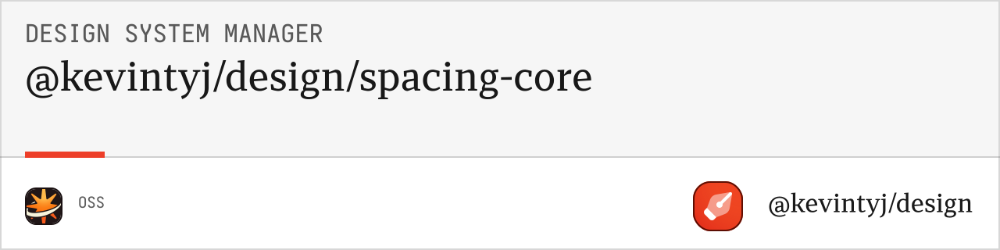

# @design/spacing-generation-core

Core spacing generation logic for design system spacing scales with 4px base multiplier system and comprehensive utilities.

## 📏 Features

- **26 spacing values** from 0px to 80px with 4px base multiplier
- **Pixel and REM variants** for flexible sizing (16px = 1rem)
- **Utility naming** compatible with Tailwind CSS conventions
- **TypeScript support** with full type safety
- **Validation utilities** for spacing definitions
- **Metadata generation** with comprehensive spacing information
- **Flexible input formats** (TypeScript, JavaScript, JSON)

## 📦 Installation

```bash
bun add @design/spacing-generation-core
```

## 🚀 Quick Start

```typescript
import { 
  loadSpacingDefinitions,
  generateSpacingSystem,
  validateSpacingInput 
} from '@design/spacing-generation-core';

// Load spacing from file
const spacingInput = await loadSpacingDefinitions('./base.ts');

// Validate spacing definitions
validateSpacingInput(spacingInput);

// Generate complete spacing system
const spacingSystem = generateSpacingSystem(spacingInput, {
  generateRem: true,
  remBase: 16
});

console.log(`Generated ${spacingSystem.metadata.totalValues} spacing values`);
```

## 📖 API Reference

### Types

#### `SpacingInput`
Core interface for spacing definitions with multiplier.

```typescript
interface SpacingInput {
  spacing: Record<string, number>;
  multiplier: number;
}
```

#### `SpacingSystem`
Complete generated spacing system with all variants and metadata.

```typescript
interface SpacingSystem {
  spacing: {
    values: Record<string, number>;      // Raw pixel values
    remValues: Record<string, string>;   // REM equivalents
    pxValues: Record<string, string>;    // Formatted px values
    multiplier: number;                  // Base multiplier (4)
  };
  metadata: {
    generatedAt: string;
    totalValues: number;
    baseMultiplier: number;
    remBase: number;
    config: Required<SpacingGenerationConfig>;
  };
}
```

#### `SpacingGenerationConfig`
Configuration options for spacing system generation.

```typescript
interface SpacingGenerationConfig {
  generateRem?: boolean;     // Generate REM values (default: true)
  remBase?: number;          // REM base size in px (default: 16)
}
```

### Core Functions

#### `generateSpacingSystem(spacingInput, config?)`

Generates a complete spacing system with px and rem variants.

**Parameters:**
- `spacingInput: SpacingInput` - Spacing definitions with multiplier
- `config?: SpacingGenerationConfig` - Optional configuration

**Returns:** `SpacingSystem`

**Example:**
```typescript
const spacingSystem = generateSpacingSystem(spacingInput, {
  generateRem: true,
  remBase: 16 // 1rem = 16px
});
```

#### `loadSpacingDefinitions(filePath)`

Loads spacing definitions from a TypeScript/JavaScript file.

**Parameters:**
- `filePath: string` - Path to the spacing definition file

**Returns:** `Promise<SpacingInput>`

**Example:**
```typescript
// Load from base.ts
const spacingInput = await loadSpacingDefinitions('./base.ts');

// Load from custom file
const spacingInput = await loadSpacingDefinitions('./spacing/values.js');
```

#### `validateSpacingInput(spacingInput)`

Validates spacing input structure and throws descriptive errors.

**Parameters:**
- `spacingInput: SpacingInput` - Spacing definitions to validate

**Throws:** Error with validation details

**Example:**
```typescript
try {
  validateSpacingInput(spacingInput);
  console.log('✓ Spacing definitions are valid');
} catch (error) {
  console.error('✗ Validation failed:', error.message);
}
```

#### `createSpacingInput(spacing, multiplier)`

Creates a spacing input object from spacing definitions.

**Parameters:**
- `spacing: Record<string, number>` - Spacing value definitions
- `multiplier: number` - Base multiplier (typically 4)

**Returns:** `SpacingInput`

**Example:**
```typescript
const spacingInput = createSpacingInput(
  {
    "0": 0,
    "1": 4,
    "2": 8,
    "4": 16,
    "px": 1
  },
  4 // 4px base multiplier
);
```

### Utility Functions

#### `pxToRem(px, remBase?)`

Converts pixel values to REM units.

**Parameters:**
- `px: number` - Pixel value to convert
- `remBase?: number` - REM base size (default: 16)

**Returns:** `string`

**Example:**
```typescript
const remValue = pxToRem(16); // "1rem"
const remValue2 = pxToRem(8, 16); // "0.5rem"
```

#### `remToPx(rem, remBase?)`

Converts REM values to pixel units.

**Parameters:**
- `rem: string | number` - REM value to convert
- `remBase?: number` - REM base size (default: 16)

**Returns:** `number`

**Example:**
```typescript
const pxValue = remToPx("1rem"); // 16
const pxValue2 = remToPx(0.5, 16); // 8
```

#### `getSpacingMetadata(spacingSystem)`

Extracts metadata information from a spacing system.

**Parameters:**
- `spacingSystem: SpacingSystem` - Generated spacing system

**Returns:** `SpacingSystemMetadata`

**Example:**
```typescript
const metadata = getSpacingMetadata(spacingSystem);
console.log(`Generated ${metadata.totalValues} spacing values with ${metadata.baseMultiplier}px base`);
```

#### `mergeSpacingSystems(systems)`

Merges multiple spacing systems into one.

**Parameters:**
- `systems: SpacingSystem[]` - Array of spacing systems to merge

**Returns:** `SpacingSystem`

**Example:**
```typescript
const baseSpacing = generateSpacingSystem(baseInput);
const customSpacing = generateSpacingSystem(customInput);
const merged = mergeSpacingSystems([baseSpacing, customSpacing]);
```

## 🎯 Spacing Scale Structure

### Default Spacing Values (26 total)

**Core Values (4px increments):**
- `0`: 0px
- `1`: 4px  
- `2`: 8px
- `3`: 12px
- `4`: 16px
- `5`: 20px
- `6`: 24px
- `7`: 28px
- `8`: 32px
- `9`: 36px
- `10`: 40px
- `11`: 44px
- `12`: 48px
- `13`: 52px
- `14`: 56px
- `15`: 60px
- `16`: 64px
- `18`: 72px
- `20`: 80px

**Pixel Variants (specific values):**
- `px`: 1px
- `2px`: 2px
- `3px`: 3px
- `5px`: 5px
- `6px`: 6px
- `10px`: 10px
- `14px`: 14px

### Generated Output Structure

```typescript
// Raw pixel values
spacing.values = {
  "0": 0,
  "px": 1,
  "1": 4,
  "2": 8,
  "4": 16
  // ... etc
}

// Formatted pixel values
spacing.pxValues = {
  "0": "0px",
  "px": "1px", 
  "1": "4px",
  "2": "8px",
  "4": "16px"
  // ... etc
}

// REM values (16px = 1rem)
spacing.remValues = {
  "0": "0rem",
  "px": "0.0625rem",
  "1": "0.25rem", 
  "2": "0.5rem",
  "4": "1rem"
  // ... etc
}
```

### Spacing Categories

**Micro spacing (0-4px):** `0`, `px`, `2px`, `3px`, `1`
- Fine-tuned adjustments
- Border widths
- Small gaps

**Small spacing (4-16px):** `1`, `5px`, `6px`, `2`, `10px`, `3`, `14px`, `4`
- Component internal spacing
- Small margins and padding
- Text spacing

**Medium spacing (16-48px):** `4`, `5`, `6`, `7`, `8`, `9`, `10`, `11`, `12`
- Section spacing
- Card padding
- Component separation

**Large spacing (48px+):** `13`, `14`, `15`, `16`, `18`, `20`
- Layout spacing
- Page sections
- Major component separation

## 💡 Usage Examples

### Basic Generation

```typescript
import { createSpacingInput, generateSpacingSystem } from '@design/spacing-generation-core';

const spacingInput = createSpacingInput(
  {
    "0": 0,
    "1": 4,
    "2": 8,
    "3": 12,
    "4": 16,
    "px": 1
  },
  4 // 4px base multiplier
);

const spacingSystem = generateSpacingSystem(spacingInput);
```

### Custom Configuration

```typescript
const spacingSystem = generateSpacingSystem(spacingInput, {
  generateRem: true,     // Include REM values
  remBase: 16           // 1rem = 16px
});

// Or skip REM generation for performance
const minimalSystem = generateSpacingSystem(spacingInput, {
  generateRem: false
});
```

### Loading from File

```typescript
// base.ts structure
export const spacing = {
  "0": 0,
  "px": 1,
  "2px": 2,
  "3px": 3,
  "1": 4,
  "5px": 5,
  "6px": 6,
  "2": 8,
  "10px": 10,
  "3": 12,
  "14px": 14,
  "4": 16,
  "5": 20,
  "6": 24,
  "7": 28,
  "8": 32,
  "9": 36,
  "10": 40,
  "11": 44,
  "12": 48,
  "13": 52,
  "14": 56,
  "15": 60,
  "16": 64,
  "18": 72,
  "20": 80
};

export const spacingMultiplier = 4;

// Load and generate
const spacingInput = await loadSpacingDefinitions('./base.ts');
const spacingSystem = generateSpacingSystem(spacingInput);
```

### Accessing Generated Values

```typescript
// Raw pixel values
const padding = spacingSystem.spacing.values["4"]; // 16

// Formatted pixel values
const margin = spacingSystem.spacing.pxValues["2"]; // "8px"

// REM values for responsive design
const gap = spacingSystem.spacing.remValues["4"]; // "1rem"

// Get all spacing values
const allValues = spacingSystem.spacing.values;
Object.entries(allValues).forEach(([key, value]) => {
  console.log(`${key}: ${value}px`);
});
```

### Validation and Error Handling

```typescript
import { validateSpacingInput, loadSpacingDefinitions } from '@design/spacing-generation-core';

try {
  const spacingInput = await loadSpacingDefinitions('./spacing.ts');
  validateSpacingInput(spacingInput);
  
  const spacingSystem = generateSpacingSystem(spacingInput);
  console.log('✓ Spacing system generated successfully');
} catch (error) {
  if (error.message.includes('Invalid spacing value')) {
    console.error('✗ Spacing validation failed:', error.message);
  } else if (error.message.includes('Missing required')) {
    console.error('✗ Missing required spacing definitions:', error.message);
  } else {
    console.error('✗ Generation failed:', error.message);
  }
}
```

### Advanced Spacing Manipulation

```typescript
import { generateSpacingSystem, getSpacingMetadata, mergeSpacingSystems } from '@design/spacing-generation-core';

// Generate base spacing system
const baseInput = createSpacingInput(
  {
    "0": 0,
    "1": 4,
    "2": 8,
    "4": 16
  },
  4
);

// Generate custom spacing system
const customInput = createSpacingInput(
  {
    "xs": 2,
    "sm": 6,
    "md": 12,
    "lg": 24,
    "xl": 48
  },
  4
);

const baseSpacing = generateSpacingSystem(baseInput);
const customSpacing = generateSpacingSystem(customInput);

// Merge systems
const completeSystem = mergeSpacingSystems([baseSpacing, customSpacing]);

// Get system metadata
const metadata = getSpacingMetadata(completeSystem);
console.log(`Total spacing values: ${metadata.totalValues}`);
console.log(`Base multiplier: ${metadata.baseMultiplier}px`);
```

## 🎨 Spacing Input Formats

### TypeScript/JavaScript Files

```typescript
// base.ts or spacing.js
export const spacing = {
  "0": 0,
  "px": 1,
  "1": 4,
  "2": 8,
  "4": 16,
  "8": 32
};

export const spacingMultiplier = 4;
```

### JSON Files

```json
{
  "spacing": {
    "0": 0,
    "px": 1,
    "1": 4,
    "2": 8,
    "4": 16,
    "8": 32
  },
  "spacingMultiplier": 4
}
```

### Alternative Naming Patterns

```typescript
// Semantic naming
export const spacing = {
  "none": 0,
  "hairline": 1,
  "xs": 4,
  "sm": 8,
  "md": 16,
  "lg": 32,
  "xl": 64
};

// T-shirt sizing
export const spacing = {
  "xs": 4,
  "s": 8,
  "m": 16,
  "l": 32,
  "xl": 64,
  "2xl": 128
};
```

## 🔧 Configuration Options

### Generation Configuration

```typescript
interface SpacingGenerationConfig {
  generateRem?: boolean;     // Include REM values (default: true)
  remBase?: number;          // REM base size in px (default: 16)
}
```

### Performance Optimization

```typescript
// Full generation with REM values
const fullConfig = {
  generateRem: true,
  remBase: 16
};

// Minimal generation (px only) for performance
const minimalConfig = {
  generateRem: false
};

// Custom REM base for different designs
const customConfig = {
  generateRem: true,
  remBase: 14 // 1rem = 14px
};
```

## 🎯 Use Cases

### Component Spacing

```typescript
// Get spacing for component margins
const componentMargin = spacingSystem.spacing.pxValues["4"]; // "16px"

// Get spacing for text elements
const textSpacing = spacingSystem.spacing.remValues["2"]; // "0.5rem"

// Get border widths
const borderWidth = spacingSystem.spacing.pxValues["px"]; // "1px"
```

### Layout Systems

```typescript
// CSS Grid gap values
const gridGap = spacingSystem.spacing.values["6"]; // 24px

// Flexbox spacing
const flexGap = spacingSystem.spacing.remValues["4"]; // "1rem"

// Container padding
const containerPadding = spacingSystem.spacing.pxValues["8"]; // "32px"
```

### Responsive Design

```typescript
// Mobile spacing (smaller values)
const mobileSpacing = {
  xs: spacingSystem.spacing.remValues["1"], // "0.25rem" 
  sm: spacingSystem.spacing.remValues["2"], // "0.5rem"
  md: spacingSystem.spacing.remValues["4"]  // "1rem"
};

// Desktop spacing (larger values)
const desktopSpacing = {
  sm: spacingSystem.spacing.remValues["4"],  // "1rem"
  md: spacingSystem.spacing.remValues["8"],  // "2rem"
  lg: spacingSystem.spacing.remValues["12"] // "3rem"
};
```

## 🧪 Testing

```typescript
import { generateSpacingSystem, validateSpacingInput } from '@design/spacing-generation-core';

// Test spacing generation
const testInput = createSpacingInput(
  {
    "0": 0,
    "1": 4,
    "2": 8
  },
  4
);

const system = generateSpacingSystem(testInput);
console.assert(system.spacing.values["1"] === 4);
console.assert(system.spacing.pxValues["2"] === "8px");
console.assert(system.spacing.remValues["4"] === "1rem");
```

## 🤝 Related Packages

- **[@design/spacing-generation-css](../spacing-generation-css)** - CSS output generation
- **[@design/spacing-generation-json](../spacing-generation-json)** - JSON output generation
- **[@design/cli](../cli)** - Command-line interface

## 📄 License

MIT License - see the [LICENSE](../../LICENSE) file for details. 