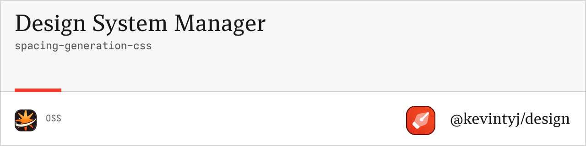

# @design/spacing-generation-css

CSS generation utilities for design system spacing. Converts spacing systems into CSS custom properties and utility classes for margin, padding, and gap.

## 📏 Features

- **CSS Custom Properties** with semantic naming
- **Utility Classes** for margin, padding, and gap
- **Multiple Output Variants** (px-only, rem-only, combined)
- **Tailwind-compatible** utility naming
- **Responsive Variants** with breakpoint support
- **Zero Dependencies** and lightweight output
- **TypeScript Support** with full type definitions

## 📦 Installation

```bash
bun add @design/spacing-generation-css
```

## 🚀 Quick Start

```typescript
import { generateCSSFiles } from '@design/spacing-generation-css';
import { generateSpacingSystem } from '@design/spacing-generation-core';

// Generate spacing system
const spacingSystem = generateSpacingSystem(spacingInput);

// Generate CSS files
const cssFiles = generateCSSFiles(spacingSystem, {
  variant: 'full',
  generateUtilityClasses: true,
  includeRem: true
});

// Write files to disk
cssFiles.forEach(file => {
  console.log(`Generated: ${file.filename}`);
  console.log(`Size: ${file.content.length} bytes`);
});
```

## 📖 API Reference

### Types

#### `CSSGenerationConfig`
```typescript
interface CSSGenerationConfig {
  variant?: CSSVariant;              // Output variant (default: "full")
  generateUtilityClasses?: boolean;  // Generate utility classes (default: true)
  includeRem?: boolean;              // Include REM variants (default: true)
  cssPrefix?: string;                // Custom property prefix (default: "--spacing")
  utilityPrefix?: string;            // Utility class prefix (default: "")
  includeNegative?: boolean;         // Include negative margins (default: false)
}
```

#### `CSSVariant`
```typescript
type CSSVariant = 
  | "px-only"     // Pixel values only
  | "rem-only"    // REM values only  
  | "combined"    // Both px and rem
  | "full";       // All variants + utilities
```

#### `CSSFile`
```typescript
interface CSSFile {
  filename: string;
  content: string;
  type: "custom-properties" | "utilities" | "combined";
  variant: CSSVariant;
}
```

### Functions

#### `generateCSSFiles(spacingSystem, config?)`

Generates CSS files from a spacing system.

**Parameters:**
- `spacingSystem: SpacingSystem` - Generated spacing system
- `config?: CSSGenerationConfig` - Configuration options

**Returns:** `CSSFile[]`

#### `generateSpacingCustomProperties(spacingSystem, config?)`

Generates CSS custom properties for spacing.

**Parameters:**
- `spacingSystem: SpacingSystem` - Generated spacing system
- `config?: CSSGenerationConfig` - Configuration options

**Returns:** `string`

#### `generateSpacingUtilityClasses(spacingSystem, config?)`

Generates utility classes for spacing.

**Parameters:**
- `spacingSystem: SpacingSystem` - Generated spacing system
- `config?: CSSGenerationConfig` - Configuration options

**Returns:** `string`

## 🎯 Generated CSS Structure

### Custom Properties

```css
:root {
  /* Pixel values */
  --spacing-0: 0px;
  --spacing-px: 1px;
  --spacing-1: 4px;
  --spacing-2: 8px;
  --spacing-4: 16px;
  --spacing-8: 32px;
  
  /* REM values */
  --spacing-0-rem: 0rem;
  --spacing-px-rem: 0.0625rem;
  --spacing-1-rem: 0.25rem;
  --spacing-2-rem: 0.5rem;
  --spacing-4-rem: 1rem;
  --spacing-8-rem: 2rem;
}
```

### Utility Classes

```css
/* Margin utilities */
.m-0 { margin: var(--spacing-0); }
.m-px { margin: var(--spacing-px); }
.m-1 { margin: var(--spacing-1); }
.m-2 { margin: var(--spacing-2); }

/* Margin directional */
.mx-1 { margin-left: var(--spacing-1); margin-right: var(--spacing-1); }
.my-1 { margin-top: var(--spacing-1); margin-bottom: var(--spacing-1); }
.mt-1 { margin-top: var(--spacing-1); }
.mr-1 { margin-right: var(--spacing-1); }
.mb-1 { margin-bottom: var(--spacing-1); }
.ml-1 { margin-left: var(--spacing-1); }

/* Padding utilities */
.p-0 { padding: var(--spacing-0); }
.p-1 { padding: var(--spacing-1); }
.p-2 { padding: var(--spacing-2); }

/* Padding directional */
.px-1 { padding-left: var(--spacing-1); padding-right: var(--spacing-1); }
.py-1 { padding-top: var(--spacing-1); padding-bottom: var(--spacing-1); }
.pt-1 { padding-top: var(--spacing-1); }
.pr-1 { padding-right: var(--spacing-1); }
.pb-1 { padding-bottom: var(--spacing-1); }
.pl-1 { padding-left: var(--spacing-1); }

/* Gap utilities */
.gap-0 { gap: var(--spacing-0); }
.gap-1 { gap: var(--spacing-1); }
.gap-2 { gap: var(--spacing-2); }
.gap-x-1 { column-gap: var(--spacing-1); }
.gap-y-1 { row-gap: var(--spacing-1); }
```

### Negative Margins (Optional)

```css
/* Negative margin utilities */
.-m-1 { margin: calc(var(--spacing-1) * -1); }
.-mt-1 { margin-top: calc(var(--spacing-1) * -1); }
.-mr-1 { margin-right: calc(var(--spacing-1) * -1); }
.-mb-1 { margin-bottom: calc(var(--spacing-1) * -1); }
.-ml-1 { margin-left: calc(var(--spacing-1) * -1); }
```

## 💡 Usage Examples

### Basic CSS Generation

```typescript
import { generateCSSFiles } from '@design/spacing-generation-css';

const cssFiles = generateCSSFiles(spacingSystem);

// Outputs:
// - spacing.css (custom properties)
// - spacing-utilities.css (utility classes)
```

### Pixel-only Output

```typescript
const cssFiles = generateCSSFiles(spacingSystem, {
  variant: 'px-only',
  includeRem: false
});

// Only generates pixel-based spacing
```

### REM-only Output

```typescript
const cssFiles = generateCSSFiles(spacingSystem, {
  variant: 'rem-only',
  includeRem: true
});

// Only generates REM-based spacing
```

### Combined Output

```typescript
const cssFiles = generateCSSFiles(spacingSystem, {
  variant: 'combined',
  generateUtilityClasses: true
});

// Generates both custom properties and utilities
```

### Custom Prefixes

```typescript
const cssFiles = generateCSSFiles(spacingSystem, {
  cssPrefix: '--space',
  utilityPrefix: 'sp-'
});

// Generates: --space-1, .sp-m-1, .sp-p-1, etc.
```

### With Negative Margins

```typescript
const cssFiles = generateCSSFiles(spacingSystem, {
  generateUtilityClasses: true,
  includeNegative: true
});

// Includes negative margin utilities: .-m-1, .-mt-2, etc.
```

### Individual Generation

```typescript
import { 
  generateSpacingCustomProperties,
  generateSpacingUtilityClasses 
} from '@design/spacing-generation-css';

// Generate only custom properties
const customProps = generateSpacingCustomProperties(spacingSystem);

// Generate only utility classes
const utilities = generateSpacingUtilityClasses(spacingSystem, {
  includeNegative: true
});
```

## 🎨 Output Variants

### Px-only Variant
- **spacing.css**: Pixel-based custom properties only
- Best for: Fixed layouts and pixel-perfect designs

### REM-only Variant  
- **spacing-rem.css**: REM-based custom properties only
- Best for: Responsive designs and accessibility

### Combined Variant
- **spacing-combined.css**: Both pixel and REM properties
- Best for: Flexible designs with mixed requirements

### Full Variant
- **spacing.css**: Custom properties
- **spacing-utilities.css**: Complete utility classes
- **spacing-rem.css**: REM variants (if enabled)
- Best for: Complete design systems

## 🛠 Integration Examples

### With Tailwind CSS

```typescript
// Generate utilities similar to Tailwind
const cssFiles = generateCSSFiles(spacingSystem, {
  variant: 'full',
  generateUtilityClasses: true,
  utilityPrefix: ''  // No prefix for Tailwind compatibility
});

// Use directly as Tailwind replacement or supplement
```

### With PostCSS

```typescript
import postcss from 'postcss';
import { generateSpacingCustomProperties } from '@design/spacing-generation-css';

const spacing = generateSpacingCustomProperties(spacingSystem);
const processed = await postcss([
  // your PostCSS plugins
]).process(spacing, { from: undefined });
```

### With CSS-in-JS

```typescript
import { generateSpacingCustomProperties } from '@design/spacing-generation-css';

const spacingCSS = generateSpacingCustomProperties(spacingSystem);

// Inject into styled-components, emotion, etc.
const GlobalStyle = createGlobalStyle`
  ${spacingCSS}
`;
```

### With Build Tools

```typescript
import { writeFileSync } from 'fs';
import { generateCSSFiles } from '@design/spacing-generation-css';

const cssFiles = generateCSSFiles(spacingSystem, {
  variant: 'full'
});

cssFiles.forEach(file => {
  writeFileSync(`./dist/css/spacing/${file.filename}`, file.content);
});
```

## 🎯 Performance

- **Lightweight Output**: Typically 3-8KB for complete spacing system
- **Efficient Selectors**: Uses CSS custom properties for better performance
- **Minimal Duplication**: Smart generation avoids redundant rules
- **Tree-shakeable**: Include only needed variants

## 🧪 Testing

```bash
# Run tests
bun test

# Test all variants
bun test --coverage

# Watch mode
bun test --watch
```

## 🛠 Development

```bash
# Install dependencies
bun install

# Build the package
bun run build

# Run linting
bun run lint

# Format code
bun run format
```

## 🎯 Utility Class Reference

### Margin Classes

| Class | Property | Description |
|-------|----------|-------------|
| `.m-{size}` | `margin` | All sides |
| `.mx-{size}` | `margin-left, margin-right` | Horizontal |
| `.my-{size}` | `margin-top, margin-bottom` | Vertical |
| `.mt-{size}` | `margin-top` | Top |
| `.mr-{size}` | `margin-right` | Right |
| `.mb-{size}` | `margin-bottom` | Bottom |
| `.ml-{size}` | `margin-left` | Left |

### Padding Classes

| Class | Property | Description |
|-------|----------|-------------|
| `.p-{size}` | `padding` | All sides |
| `.px-{size}` | `padding-left, padding-right` | Horizontal |
| `.py-{size}` | `padding-top, padding-bottom` | Vertical |
| `.pt-{size}` | `padding-top` | Top |
| `.pr-{size}` | `padding-right` | Right |
| `.pb-{size}` | `padding-bottom` | Bottom |
| `.pl-{size}` | `padding-left` | Left |

### Gap Classes

| Class | Property | Description |
|-------|----------|-------------|
| `.gap-{size}` | `gap` | Grid/flex gap |
| `.gap-x-{size}` | `column-gap` | Horizontal gap |
| `.gap-y-{size}` | `row-gap` | Vertical gap |

## 🤝 Related Packages

- **[@design/spacing-generation-core](../spacing-generation-core)** - Core spacing generation
- **[@design/spacing-generation-json](../spacing-generation-json)** - JSON output formats
- **[@design/cli](../cli)** - Command-line interface

## 📄 License

MIT License - see the [LICENSE](../../LICENSE) file for details. 