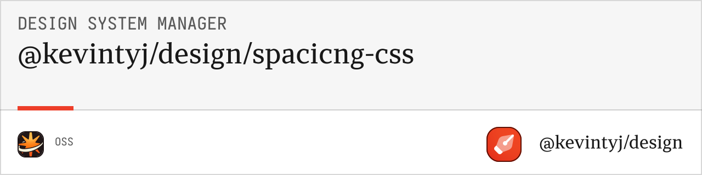

# @kevintyj/design-spacing-css

CSS generation utilities for design system spacing. Converts spacing systems into CSS custom properties and utility classes for margin, padding, and gap.

## 📏 Features

- **CSS Custom Properties** with semantic naming
- **Utility Classes** for margin, padding, and gap
- **Multiple Output Variants** (px-only, rem-only, combined)
- **Tailwind-compatible** utility naming
- **Responsive Variants** with breakpoint support
- **Negative Margins** for advanced layouts
- **Zero Dependencies** and lightweight output
- **TypeScript Support** with full type definitions

## 📦 Installation

```bash
bun add @kevintyj/design-spacing-css
```

## 🚀 Quick Start

```typescript
import { generateCSSFiles } from '@kevintyj/design-spacing-css';
import { generateSpacingSystem } from '@kevintyj/design-spacing-core';

// Generate spacing system
const spacingSystem = generateSpacingSystem(spacingInput);

// Generate CSS files
const cssFiles = generateCSSFiles(spacingSystem, {
  variant: 'full',
  generateUtilityClasses: true,
  includeRem: true
});

// Write files to disk
cssFiles.forEach(file => {
  console.log(`Generated: ${file.filename}`);
  console.log(`Type: ${file.type}`);
  console.log(`Size: ${file.content.length} bytes`);
});
```

## 📖 API Reference

### Types

#### `CSSGenerationConfig`
Configuration options for CSS generation.

```typescript
interface CSSGenerationConfig {
  variant?: CSSVariant;              // Output variant (default: "full")
  generateUtilityClasses?: boolean;  // Generate utility classes (default: true)
  includeRem?: boolean;              // Include REM variants (default: true)
  cssPrefix?: string;                // Custom property prefix (default: "--spacing")
  utilityPrefix?: string;            // Utility class prefix (default: "")
  includeNegative?: boolean;         // Include negative margins (default: false)
  includeBreakpoints?: boolean;      // Include responsive utilities (default: false)
  breakpoints?: Record<string, string>; // Custom breakpoints
}
```

#### `CSSVariant`
Different CSS output formats.

```typescript
type CSSVariant = 
  | "px-only"     // Pixel values only
  | "rem-only"    // REM values only  
  | "combined"    // Both px and rem
  | "full";       // All variants + utilities
```

#### `CSSFile`
Generated CSS file structure.

```typescript
interface CSSFile {
  filename: string;
  content: string;
  type: "custom-properties" | "utilities" | "combined" | "responsive";
  variant: CSSVariant;
  size: number;
  metadata: {
    spacingCount: number;
    propertyCount: number;
    hasRem: boolean;
    hasUtilities: boolean;
    hasNegative: boolean;
    hasResponsive: boolean;
  };
}
```

### Core Functions

#### `generateCSSFiles(spacingSystem, config?)`

Generates CSS files from a spacing system with specified configuration.

**Parameters:**
- `spacingSystem: SpacingSystem` - Generated spacing system from core package
- `config?: CSSGenerationConfig` - Configuration options

**Returns:** `CSSFile[]`

**Example:**
```typescript
const cssFiles = generateCSSFiles(spacingSystem, {
  variant: 'combined',
  generateUtilityClasses: true,
  includeRem: true,
  includeNegative: true
});

// Results in files like:
// - spacing.css (custom properties)
// - spacing-utilities.css (utility classes)
// - spacing-combined.css (everything)
```

#### `generateSpacingCustomProperties(spacingSystem, config?)`

Generates CSS custom properties for spacing with optional REM variants.

**Parameters:**
- `spacingSystem: SpacingSystem` - Generated spacing system
- `config?: CSSGenerationConfig` - Configuration options

**Returns:** `string`

**Example:**
```typescript
const customProperties = generateSpacingCustomProperties(spacingSystem, {
  includeRem: true,
  cssPrefix: '--space'
});
```

#### `generateSpacingUtilityClasses(spacingSystem, config?)`

Generates utility classes for spacing with Tailwind-compatible naming.

**Parameters:**
- `spacingSystem: SpacingSystem` - Generated spacing system
- `config?: CSSGenerationConfig` - Configuration options

**Returns:** `string`

**Example:**
```typescript
const utilities = generateSpacingUtilityClasses(spacingSystem, {
  includeNegative: true,
  utilityPrefix: 'tw-',
  includeBreakpoints: true
});
```

### Utility Functions

#### `generateMarginUtilities(spacingSystem, config?)`

Generates margin utility classes only.

**Parameters:**
- `spacingSystem: SpacingSystem` - Generated spacing system
- `config?: CSSGenerationConfig` - Configuration options

**Returns:** `string`

#### `generatePaddingUtilities(spacingSystem, config?)`

Generates padding utility classes only.

**Parameters:**
- `spacingSystem: SpacingSystem` - Generated spacing system
- `config?: CSSGenerationConfig` - Configuration options

**Returns:** `string`

#### `generateGapUtilities(spacingSystem, config?)`

Generates gap utility classes for flexbox and grid.

**Parameters:**
- `spacingSystem: SpacingSystem` - Generated spacing system
- `config?: CSSGenerationConfig` - Configuration options

**Returns:** `string`

#### `generateResponsiveUtilities(spacingSystem, config?)`

Generates responsive variants of utility classes.

**Parameters:**
- `spacingSystem: SpacingSystem` - Generated spacing system
- `config?: CSSGenerationConfig` - Configuration options with breakpoints

**Returns:** `string`

## 🎯 Generated CSS Structure

### Custom Properties

```css
:root {
  /* Pixel values */
  --spacing-0: 0px;
  --spacing-px: 1px;
  --spacing-2px: 2px;
  --spacing-3px: 3px;
  --spacing-1: 4px;
  --spacing-5px: 5px;
  --spacing-6px: 6px;
  --spacing-2: 8px;
  --spacing-10px: 10px;
  --spacing-3: 12px;
  --spacing-14px: 14px;
  --spacing-4: 16px;
  --spacing-5: 20px;
  --spacing-6: 24px;
  --spacing-8: 32px;
  --spacing-12: 48px;
  --spacing-16: 64px;
  --spacing-20: 80px;
  
  /* REM values */
  --spacing-0-rem: 0rem;
  --spacing-px-rem: 0.0625rem;
  --spacing-1-rem: 0.25rem;
  --spacing-2-rem: 0.5rem;
  --spacing-4-rem: 1rem;
  --spacing-8-rem: 2rem;
  --spacing-12-rem: 3rem;
  --spacing-16-rem: 4rem;
  --spacing-20-rem: 5rem;
}
```

### Utility Classes

#### Margin Utilities

```css
/* All sides margin */
.m-0 { margin: var(--spacing-0); }
.m-px { margin: var(--spacing-px); }
.m-1 { margin: var(--spacing-1); }
.m-2 { margin: var(--spacing-2); }
.m-4 { margin: var(--spacing-4); }
.m-8 { margin: var(--spacing-8); }

/* Directional margins */
.mx-0 { margin-left: var(--spacing-0); margin-right: var(--spacing-0); }
.mx-1 { margin-left: var(--spacing-1); margin-right: var(--spacing-1); }
.my-0 { margin-top: var(--spacing-0); margin-bottom: var(--spacing-0); }
.my-1 { margin-top: var(--spacing-1); margin-bottom: var(--spacing-1); }

/* Individual sides */
.mt-0 { margin-top: var(--spacing-0); }
.mt-1 { margin-top: var(--spacing-1); }
.mr-0 { margin-right: var(--spacing-0); }
.mr-1 { margin-right: var(--spacing-1); }
.mb-0 { margin-bottom: var(--spacing-0); }
.mb-1 { margin-bottom: var(--spacing-1); }
.ml-0 { margin-left: var(--spacing-0); }
.ml-1 { margin-left: var(--spacing-1); }
```

#### Padding Utilities

```css
/* All sides padding */
.p-0 { padding: var(--spacing-0); }
.p-px { padding: var(--spacing-px); }
.p-1 { padding: var(--spacing-1); }
.p-2 { padding: var(--spacing-2); }
.p-4 { padding: var(--spacing-4); }
.p-8 { padding: var(--spacing-8); }

/* Directional padding */
.px-0 { padding-left: var(--spacing-0); padding-right: var(--spacing-0); }
.px-1 { padding-left: var(--spacing-1); padding-right: var(--spacing-1); }
.py-0 { padding-top: var(--spacing-0); padding-bottom: var(--spacing-0); }
.py-1 { padding-top: var(--spacing-1); padding-bottom: var(--spacing-1); }

/* Individual sides */
.pt-0 { padding-top: var(--spacing-0); }
.pt-1 { padding-top: var(--spacing-1); }
.pr-0 { padding-right: var(--spacing-0); }
.pr-1 { padding-right: var(--spacing-1); }
.pb-0 { padding-bottom: var(--spacing-0); }
.pb-1 { padding-bottom: var(--spacing-1); }
.pl-0 { padding-left: var(--spacing-0); }
.pl-1 { padding-left: var(--spacing-1); }
```

#### Gap Utilities

```css
/* Gap for flexbox and grid */
.gap-0 { gap: var(--spacing-0); }
.gap-1 { gap: var(--spacing-1); }
.gap-2 { gap: var(--spacing-2); }
.gap-4 { gap: var(--spacing-4); }
.gap-8 { gap: var(--spacing-8); }

/* Directional gaps */
.gap-x-0 { column-gap: var(--spacing-0); }
.gap-x-1 { column-gap: var(--spacing-1); }
.gap-y-0 { row-gap: var(--spacing-0); }
.gap-y-1 { row-gap: var(--spacing-1); }
```

#### Negative Margins

```css
/* Negative margin utilities (when includeNegative: true) */
.-m-1 { margin: calc(var(--spacing-1) * -1); }
.-m-2 { margin: calc(var(--spacing-2) * -1); }
.-m-4 { margin: calc(var(--spacing-4) * -1); }

/* Negative directional margins */
.-mx-1 { margin-left: calc(var(--spacing-1) * -1); margin-right: calc(var(--spacing-1) * -1); }
.-my-1 { margin-top: calc(var(--spacing-1) * -1); margin-bottom: calc(var(--spacing-1) * -1); }

/* Negative individual sides */
.-mt-1 { margin-top: calc(var(--spacing-1) * -1); }
.-mr-1 { margin-right: calc(var(--spacing-1) * -1); }
.-mb-1 { margin-bottom: calc(var(--spacing-1) * -1); }
.-ml-1 { margin-left: calc(var(--spacing-1) * -1); }
```

#### Responsive Variants

```css
/* Responsive utilities (when includeBreakpoints: true) */
@media (min-width: 640px) {
  .sm\:m-0 { margin: var(--spacing-0); }
  .sm\:m-1 { margin: var(--spacing-1); }
  .sm\:p-0 { padding: var(--spacing-0); }
  .sm\:p-1 { padding: var(--spacing-1); }
}

@media (min-width: 768px) {
  .md\:m-0 { margin: var(--spacing-0); }
  .md\:p-0 { padding: var(--spacing-0); }
}

@media (min-width: 1024px) {
  .lg\:m-0 { margin: var(--spacing-0); }
  .lg\:p-0 { padding: var(--spacing-0); }
}
```

## 💡 Usage Examples

### Basic CSS Generation

```typescript
import { generateCSSFiles } from '@kevintyj/design-spacing-css';

const cssFiles = generateCSSFiles(spacingSystem);

// Default output files:
// - spacing.css (custom properties)
// - spacing-utilities.css (utility classes)

cssFiles.forEach(file => {
  console.log(`File: ${file.filename}`);
  console.log(`Type: ${file.type}`);
  console.log(`Spacing values: ${file.metadata.spacingCount}`);
  console.log(`Properties: ${file.metadata.propertyCount}`);
});
```

### Pixel-only Output

```typescript
const cssFiles = generateCSSFiles(spacingSystem, {
  variant: 'px-only',
  includeRem: false,
  generateUtilityClasses: true
});

// Results in:
// - spacing-px.css (pixel custom properties only)
// - spacing-utilities-px.css (utilities with px values)
```

### REM-only Output

```typescript
const cssFiles = generateCSSFiles(spacingSystem, {
  variant: 'rem-only',
  includeRem: true,
  generateUtilityClasses: true
});

// Results in:
// - spacing-rem.css (REM custom properties only)
// - spacing-utilities-rem.css (utilities with REM values)
```

### Combined Output

```typescript
const cssFiles = generateCSSFiles(spacingSystem, {
  variant: 'combined',
  includeRem: true,
  generateUtilityClasses: true,
  includeNegative: true
});

// Results in:
// - spacing-combined.css (both px and REM properties)
// - spacing-utilities-combined.css (utilities with negative margins)
```

### Full Output with Everything

```typescript
const cssFiles = generateCSSFiles(spacingSystem, {
  variant: 'full',
  includeRem: true,
  generateUtilityClasses: true,
  includeNegative: true,
  includeBreakpoints: true,
  breakpoints: {
    sm: '640px',
    md: '768px', 
    lg: '1024px',
    xl: '1280px'
  }
});

// Results in:
// - spacing-full.css (everything in one file)
```

### Custom Prefixes and Configuration

```typescript
const cssFiles = generateCSSFiles(spacingSystem, {
  cssPrefix: '--space',           // Custom property prefix
  utilityPrefix: 'tw-',          // Utility class prefix
  includeNegative: true,
  includeBreakpoints: false
});

// Generated CSS will use:
// --space-1: 4px;
// .tw-m-1 { margin: var(--space-1); }
```

### Programmatic CSS Generation

```typescript
import { 
  generateSpacingCustomProperties, 
  generateSpacingUtilityClasses 
} from '@kevintyj/design-spacing-css';

// Generate only custom properties
const customProperties = generateSpacingCustomProperties(spacingSystem, {
  includeRem: true,
  cssPrefix: '--spacing'
});

// Generate only utilities
const utilities = generateSpacingUtilityClasses(spacingSystem, {
  includeNegative: false,
  utilityPrefix: ''
});

// Use strings directly
document.head.appendChild(
  createStyleElement(customProperties + utilities)
);
```

### Minimal Output for Performance

```typescript
const cssFiles = generateCSSFiles(spacingSystem, {
  variant: 'px-only',            // Pixel values only
  includeRem: false,             // No REM variants
  generateUtilityClasses: false, // No utility classes
  includeNegative: false,        // No negative margins
  includeBreakpoints: false      // No responsive variants
});

// Results in minimal CSS with just px custom properties
```

## 🎨 CSS Output Variants

### Pixel-only Variant

**spacing-px.css:**
```css
:root {
  --spacing-0: 0px;
  --spacing-1: 4px;
  --spacing-2: 8px;
  --spacing-4: 16px;
  /* Pixel values only */
}
```

### REM-only Variant

**spacing-rem.css:**
```css
:root {
  --spacing-0-rem: 0rem;
  --spacing-1-rem: 0.25rem;
  --spacing-2-rem: 0.5rem;
  --spacing-4-rem: 1rem;
  /* REM values only */
}
```

### Combined Variant

**spacing-combined.css:**
```css
:root {
  /* Pixel values */
  --spacing-0: 0px;
  --spacing-1: 4px;
  --spacing-2: 8px;
  
  /* REM values */
  --spacing-0-rem: 0rem;
  --spacing-1-rem: 0.25rem;
  --spacing-2-rem: 0.5rem;
}

/* Utility classes */
.m-0 { margin: var(--spacing-0); }
.p-1 { padding: var(--spacing-1); }
```

### Full Variant

**spacing-full.css:**
```css
:root {
  /* All custom properties */
  --spacing-0: 0px;
  --spacing-1-rem: 0.25rem;
  /* ... all spacing values ... */
}

/* All utility classes */
.m-0 { margin: var(--spacing-0); }
.p-1 { padding: var(--spacing-1); }
.-m-1 { margin: calc(var(--spacing-1) * -1); }

/* Responsive variants */
@media (min-width: 640px) {
  .sm\:m-0 { margin: var(--spacing-0); }
}
```

## 🔧 Advanced Configuration

### Performance Optimization

```typescript
// Minimal CSS for fast loading
const minimalConfig = {
  variant: 'px-only' as const,
  includeRem: false,
  generateUtilityClasses: false,
  includeNegative: false,
  includeBreakpoints: false
};

// Full-featured CSS for comprehensive design systems
const fullConfig = {
  variant: 'full' as const,
  includeRem: true,
  generateUtilityClasses: true,
  includeNegative: true,
  includeBreakpoints: true,
  breakpoints: {
    sm: '640px',
    md: '768px',
    lg: '1024px',
    xl: '1280px',
    '2xl': '1536px'
  }
};
```

### Framework Integration

```typescript
// Tailwind CSS compatible
const tailwindConfig = {
  utilityPrefix: '',
  includeNegative: true,
  includeBreakpoints: true,
  variant: 'combined' as const
};

// Bootstrap compatible
const bootstrapConfig = {
  cssPrefix: '--bs-spacing',
  utilityPrefix: 'bs-',
  includeBreakpoints: true,
  breakpoints: {
    sm: '576px',
    md: '768px',
    lg: '992px',
    xl: '1200px'
  }
};

// Custom framework
const customConfig = {
  cssPrefix: '--my-space',
  utilityPrefix: 'space-',
  includeRem: true,
  variant: 'full' as const
};
```

### Responsive Breakpoints

```typescript
const responsiveConfig = {
  includeBreakpoints: true,
  breakpoints: {
    mobile: '480px',
    tablet: '768px',
    desktop: '1024px',
    wide: '1280px'
  }
};

// Results in responsive utilities like:
// .mobile\:m-4, .tablet\:p-8, .desktop\:gap-12
```

## 🛠 Integration Examples

### Build Tools

```typescript
// Webpack integration
import { generateCSSFiles } from '@kevintyj/design-spacing-css';

const cssFiles = generateCSSFiles(spacingSystem, {
  variant: 'combined',
  generateUtilityClasses: true
});

cssFiles.forEach(file => {
  fs.writeFileSync(`./dist/css/${file.filename}`, file.content);
});
```

### React Integration

```typescript
// React hook for dynamic spacing CSS
function useSpacingCSS(spacingSystem: SpacingSystem) {
  const [css, setCSS] = useState('');
  
  useEffect(() => {
    const customProperties = generateSpacingCustomProperties(spacingSystem);
    const utilities = generateSpacingUtilityClasses(spacingSystem);
    setCSS(customProperties + utilities);
  }, [spacingSystem]);
  
  return css;
}

// Component using spacing utilities
function SpacedComponent() {
  return (
    <div className="p-4 m-2 gap-3">
      <div className="mt-8 mb-4">Content</div>
    </div>
  );
}
```

### Node.js Script

```typescript
// Generate spacing CSS files script
import { writeFile } from 'fs/promises';
import { generateCSSFiles } from '@kevintyj/design-spacing-css';

async function generateSpacingCSS() {
  const cssFiles = generateCSSFiles(spacingSystem, {
    variant: 'full',
    includeNegative: true,
    includeBreakpoints: true
  });
  
  await Promise.all(
    cssFiles.map(file =>
      writeFile(`./output/css/spacing/${file.filename}`, file.content)
    )
  );
  
  console.log(`Generated ${cssFiles.length} spacing CSS files`);
  cssFiles.forEach(file => {
    console.log(`  ${file.filename} (${file.size} bytes)`);
  });
}
```

### PostCSS Integration

```typescript
// PostCSS plugin for spacing generation
import { generateSpacingCustomProperties } from '@kevintyj/design-spacing-css';

const spacingPlugin = (spacingSystem) => {
  return {
    postcssPlugin: 'spacing-generation',
    Root(root) {
      const spacingCSS = generateSpacingCustomProperties(spacingSystem);
      root.prepend(spacingCSS);
    }
  };
};
```

## 🧪 Testing

```typescript
import { 
  generateCSSFiles, 
  generateSpacingUtilityClasses,
  generateSpacingCustomProperties 
} from '@kevintyj/design-spacing-css';

// Test CSS generation
const cssFiles = generateCSSFiles(testSpacingSystem);
console.assert(cssFiles.length > 0);
console.assert(cssFiles[0].filename.endsWith('.css'));

// Test utility generation
const utilities = generateSpacingUtilityClasses(testSpacingSystem);
console.assert(utilities.includes('.m-'));
console.assert(utilities.includes('.p-'));
console.assert(utilities.includes('.gap-'));

// Test custom properties
const properties = generateSpacingCustomProperties(testSpacingSystem);
console.assert(properties.includes('--spacing-'));
```

## 🤝 Related Packages

- **[@kevintyj/design-spacing-core](../spacing-generation-core)** - Core spacing generation logic
- **[@kevintyj/design-spacing-json](../spacing-generation-json)** - JSON format generation
- **[@kevintyj/design/cli](../cli)** - Command-line interface

## 📄 License

MIT License - see the [LICENSE](../../LICENSE) file for details. 