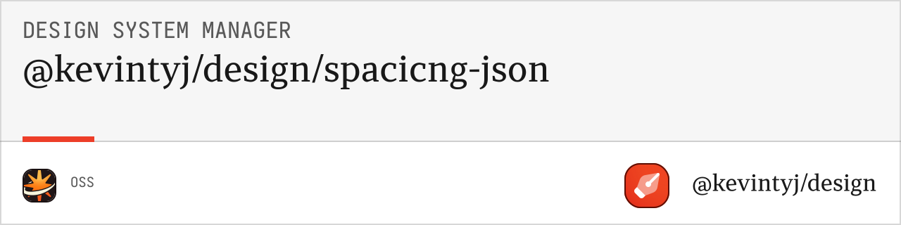

# @kevintyj/design/spacing-generation-json

JSON generation utilities for design system spacing. Converts spacing systems into various JSON formats including design tokens, Tailwind config, and Figma collections.

## 📏 Features

- **Multiple JSON Formats** (flat, nested, tokens, Tailwind, collections)
- **Design Token Standard** compliance with W3C specification
- **Figma Collections** for seamless Figma integration
- **Tailwind Configuration** ready-to-use spacing configs
- **Pretty Printing** for human-readable output
- **Metadata Inclusion** with generation timestamps
- **TypeScript Support** with full type definitions

## 📦 Installation

```bash
bun add @kevintyj/design/spacing-generation-json
```

## 🚀 Quick Start

```typescript
import { generateJSONFiles } from '@kevintyj/design/spacing-generation-json';
import { generateSpacingSystem } from '@kevintyj/design/spacing-generation-core';

// Generate spacing system
const spacingSystem = generateSpacingSystem(spacingInput);

// Generate JSON files
const jsonFiles = generateJSONFiles(spacingSystem, {
  format: 'all',
  prettyPrint: true,
  includeMetadata: true
});

// Write files to disk
jsonFiles.forEach(file => {
  console.log(`Generated: ${file.filename}`);
  console.log(`Format: ${file.format}`);
});
```

## 📖 API Reference

### Types

#### `JSONGenerationConfig`
```typescript
interface JSONGenerationConfig {
  format?: JSONFormat | 'all';     // Output format(s)
  prettyPrint?: boolean;           // Pretty print JSON (default: false)
  includeMetadata?: boolean;       // Include generation metadata (default: true)
  includeRem?: boolean;            // Include REM values (default: true)
  figmaCompatible?: boolean;       // Generate Figma-compatible format (default: false)
}
```

#### `JSONFormat`
```typescript
type JSONFormat = 
  | "flat"        // Flat key-value pairs
  | "nested"      // Nested object structure
  | "tokens"      // W3C Design Tokens format
  | "tailwind"    // Tailwind CSS config format
  | "collections"; // Figma collections format
```

#### `JSONFile`
```typescript
interface JSONFile {
  filename: string;
  content: string;
  format: JSONFormat;
  metadata?: {
    generatedAt: string;
    totalValues: number;
    format: string;
  };
}
```

### Functions

#### `generateJSONFiles(spacingSystem, config?)`

Generates JSON files from a spacing system.

**Parameters:**
- `spacingSystem: SpacingSystem` - Generated spacing system
- `config?: JSONGenerationConfig` - Configuration options

**Returns:** `JSONFile[]`

#### `generateFlatJSON(spacingSystem, config?)`

Generates flat key-value JSON format.

**Parameters:**
- `spacingSystem: SpacingSystem` - Generated spacing system
- `config?: JSONGenerationConfig` - Configuration options

**Returns:** `string`

#### `generateNestedJSON(spacingSystem, config?)`

Generates nested object JSON format.

**Parameters:**
- `spacingSystem: SpacingSystem` - Generated spacing system
- `config?: JSONGenerationConfig` - Configuration options

**Returns:** `string`

#### `generateDesignTokensJSON(spacingSystem, config?)`

Generates W3C Design Tokens format.

**Parameters:**
- `spacingSystem: SpacingSystem` - Generated spacing system
- `config?: JSONGenerationConfig` - Configuration options

**Returns:** `string`

#### `generateTailwindSpacingJSON(spacingSystem, config?)`

Generates Tailwind CSS spacing configuration.

**Parameters:**
- `spacingSystem: SpacingSystem` - Generated spacing system
- `config?: JSONGenerationConfig` - Configuration options

**Returns:** `string`

#### `generateFigmaCollectionsJSON(spacingSystem, config?)`

Generates Figma collections format for spacing.

**Parameters:**
- `spacingSystem: SpacingSystem` - Generated spacing system
- `config?: JSONGenerationConfig` - Configuration options

**Returns:** `string`

## 🎯 Output Formats

### Flat Format

Simple key-value pairs for easy integration:

```json
{
  "0": "0px",
  "px": "1px",
  "1": "4px",
  "2": "8px",
  "4": "16px",
  "8": "32px",
  "16": "64px",
  "0-rem": "0rem",
  "px-rem": "0.0625rem",
  "1-rem": "0.25rem",
  "2-rem": "0.5rem",
  "4-rem": "1rem"
}
```

### Nested Format

Organized object structure:

```json
{
  "spacing": {
    "pixel": {
      "0": "0px",
      "px": "1px",
      "1": "4px",
      "2": "8px",
      "4": "16px"
    },
    "rem": {
      "0": "0rem",
      "px": "0.0625rem",
      "1": "0.25rem",
      "2": "0.5rem",
      "4": "1rem"
    },
    "raw": {
      "0": 0,
      "px": 1,
      "1": 4,
      "2": 8,
      "4": 16
    }
  }
}
```

### Design Tokens Format

W3C Design Tokens specification:

```json
{
  "spacing": {
    "0": {
      "value": "0px",
      "type": "dimension",
      "description": "No spacing"
    },
    "1": {
      "value": "4px",
      "type": "dimension", 
      "description": "Extra small spacing"
    },
    "4": {
      "value": "16px",
      "type": "dimension",
      "description": "Base spacing unit"
    }
  }
}
```

### Tailwind Config Format

Ready-to-use Tailwind spacing configuration:

```json
{
  "theme": {
    "extend": {
      "spacing": {
        "0": "0px",
        "px": "1px",
        "1": "4px",
        "2": "8px",
        "3": "12px",
        "4": "16px",
        "5": "20px",
        "6": "24px",
        "8": "32px",
        "10": "40px",
        "12": "48px",
        "16": "64px",
        "20": "80px"
      }
    }
  }
}
```

### Figma Collections Format

Figma-compatible variable collections:

```json
{
  "collections": [
    {
      "name": "Spacing",
      "modes": [
        { "name": "Default", "modeId": "default" }
      ],
      "variables": [
        {
          "name": "spacing/0",
          "type": "FLOAT",
          "values": {
            "default": 0
          }
        },
        {
          "name": "spacing/1",
          "type": "FLOAT", 
          "values": {
            "default": 4
          }
        }
      ]
    }
  ]
}
```

## 💡 Usage Examples

### Generate All Formats

```typescript
import { generateJSONFiles } from '@kevintyj/design/spacing-generation-json';

const jsonFiles = generateJSONFiles(spacingSystem, {
  format: 'all',
  prettyPrint: true,
  includeRem: true
});

// Outputs:
// - spacing-flat.json
// - spacing-nested.json  
// - spacing-tokens.json
// - spacing-tailwind.json
// - spacing-collections.json
```

### Tailwind Configuration

```typescript
const jsonFiles = generateJSONFiles(spacingSystem, {
  format: 'tailwind',
  prettyPrint: true,
  includeRem: false  // Pixel values only
});

// Ready for tailwind.config.js
```

### Design Tokens

```typescript
const jsonFiles = generateJSONFiles(spacingSystem, {
  format: 'tokens',
  prettyPrint: true,
  includeMetadata: true
});

// W3C Design Tokens format
```

### Figma Integration

```typescript
const jsonFiles = generateJSONFiles(spacingSystem, {
  format: 'collections',
  figmaCompatible: true,
  includeRem: false  // Use raw pixel values for Figma
});

// Optimized for Figma variable import
```

### Custom Configuration

```typescript
const jsonFiles = generateJSONFiles(spacingSystem, {
  format: 'nested',
  prettyPrint: false,       // Minified output
  includeMetadata: false,   // No metadata
  includeRem: false        // Pixel values only
});
```

### Individual Format Generation

```typescript
import { 
  generateFlatJSON,
  generateTailwindSpacingJSON,
  generateDesignTokensJSON 
} from '@kevintyj/design/spacing-generation-json';

// Generate specific formats
const flatSpacing = generateFlatJSON(spacingSystem);
const tailwindSpacing = generateTailwindSpacingJSON(spacingSystem);
const designTokens = generateDesignTokensJSON(spacingSystem);
```

### Reordering Output

All generated formats are automatically ordered by spacing value (smallest to largest), but you can also apply reordering to any spacing-related object:

```typescript
import { reorderSpacingOutput } from '@kevintyj/design/spacing-generation-json';

// Reorder any object by spacing values
const unorderedSpacing = {
  "xl": "24px",
  "xs": "4px", 
  "lg": "16px",
  "sm": "8px"
};

const spacingValues = { "xs": 4, "sm": 8, "lg": 16, "xl": 24 };
const reordered = reorderSpacingOutput(unorderedSpacing, spacingValues);
// Result: { "xs": "4px", "sm": "8px", "lg": "16px", "xl": "24px" }

// Works recursively on nested objects
const complexObject = {
  theme: {
    spacing: unorderedSpacing,
    colors: { /* preserved */ }
  }
};
const reorderedComplex = reorderSpacingOutput(complexObject, spacingValues);
```

## 🛠 Integration Examples

### With Tailwind CSS

```typescript
import { generateTailwindSpacingJSON } from '@kevintyj/design/spacing-generation-json';

const tailwindSpacing = JSON.parse(generateTailwindSpacingJSON(spacingSystem));

// tailwind.config.js
module.exports = {
  ...tailwindSpacing,
  content: ['./src/**/*.{js,ts,jsx,tsx}'],
  // ... other config
};
```

### With Style Dictionary

```typescript
import { generateDesignTokensJSON } from '@kevintyj/design/spacing-generation-json';

const tokens = JSON.parse(generateDesignTokensJSON(spacingSystem));

// tokens.json for Style Dictionary
// Generates platform-specific outputs (iOS, Android, Web)
```

### With Figma Plugin

```typescript
import { generateFigmaCollectionsJSON } from '@kevintyj/design/spacing-generation-json';

const collections = JSON.parse(generateFigmaCollectionsJSON(spacingSystem, {
  figmaCompatible: true
}));

// Import into Figma via plugin API
figma.variables.importVariableByKeyAsync(collections);
```

### With Build Tools

```typescript
import { writeFileSync } from 'fs';
import { generateJSONFiles } from '@kevintyj/design/spacing-generation-json';

const jsonFiles = generateJSONFiles(spacingSystem, {
  format: 'all',
  prettyPrint: process.env.NODE_ENV === 'development'
});

jsonFiles.forEach(file => {
  writeFileSync(`./dist/json/spacing/${file.filename}`, file.content);
});
```

### With CSS-in-JS

```typescript
import { generateFlatJSON } from '@kevintyj/design/spacing-generation-json';

const spacingTokens = JSON.parse(generateFlatJSON(spacingSystem));

// Use with styled-components, emotion, etc.
const theme = {
  spacing: spacingTokens
};

const StyledDiv = styled.div`
  margin: ${props => props.theme.spacing['4']};
  padding: ${props => props.theme.spacing['2']};
`;
```

## 🎯 Format Comparison

| Format | Use Case | Structure | Integration |
|--------|----------|-----------|-------------|
| **Flat** | Simple integrations | Key-value pairs | Easy parsing |
| **Nested** | Complex applications | Organized objects | Tree structure |
| **Tokens** | Design systems | W3C standard | Cross-platform |
| **Tailwind** | Tailwind CSS | Config format | Direct import |
| **Collections** | Figma workflows | Variable collections | Figma plugins |

## 🧪 Testing

```bash
# Run tests
bun test

# Test all formats
bun test --coverage

# Watch mode
bun test --watch
```

## 🛠 Development

```bash
# Install dependencies
bun install

# Build the package
bun run build

# Run linting
bun run lint

# Format code
bun run format
```

## 📊 Output Metadata

Generated files include rich metadata:

```json
{
  "metadata": {
    "generatedAt": "2024-01-01T12:00:00.000Z",
    "totalValues": 26,
    "baseMultiplier": 4,
    "remBase": 16,
    "format": "tailwind",
    "generator": "@kevintyj/design/spacing-generation-json",
    "version": "1.0.0"
  }
}
```

## 🎯 Spacing Value Reference

### Core Spacing Values
- `0`: 0px (no spacing)
- `px`: 1px (hairline border)
- `1`: 4px (extra small)
- `2`: 8px (small)
- `4`: 16px (base unit)
- `8`: 32px (large)
- `16`: 64px (extra large)

### Extended Values
- `3`, `5`, `6`, `7`, `9`, `10`, `11`, `12`: Medium range spacing
- `13`, `14`, `15`, `18`, `20`: Large range spacing
- Custom pixel variants: `2px`, `3px`, `5px`, `6px`, `10px`, `14px`

## 🤝 Related Packages

- **[@kevintyj/design/spacing-generation-core](../spacing-generation-core)** - Core spacing generation
- **[@kevintyj/design/spacing-generation-css](../spacing-generation-css)** - CSS output generation
- **[@kevintyj/design/cli](../cli)** - Command-line interface

## 📄 License

MIT License - see the [LICENSE](../../LICENSE) file for details. 